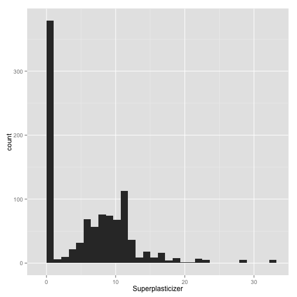
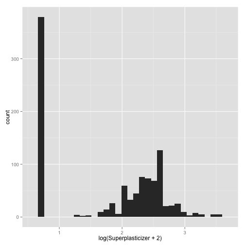
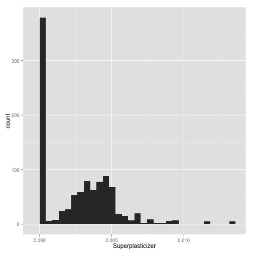

Developing Data Products using R
========================================================


```r
rm(list = ls())
```


AppliedPredictiveModeling package is used to reproduce the analyses in the text. 


```r
library(caret)
```

```
## Loading required package: lattice
## Loading required package: ggplot2
```

```r
library(AppliedPredictiveModeling)
```


```r
data(concrete)
```


```r
# ?concrete
```


```r
summary(concrete)
```

```
##      Cement    BlastFurnaceSlag     FlyAsh          Water     Superplasticizer CoarseAggregate FineAggregate      Age        CompressiveStrength
##  Min.   :102   Min.   :  0.0    Min.   :  0.0   Min.   :122   Min.   : 0.0     Min.   : 801    Min.   :594   Min.   :  1.0   Min.   : 2.33      
##  1st Qu.:192   1st Qu.:  0.0    1st Qu.:  0.0   1st Qu.:165   1st Qu.: 0.0     1st Qu.: 932    1st Qu.:731   1st Qu.:  7.0   1st Qu.:23.71      
##  Median :273   Median : 22.0    Median :  0.0   Median :185   Median : 6.4     Median : 968    Median :780   Median : 28.0   Median :34.45      
##  Mean   :281   Mean   : 73.9    Mean   : 54.2   Mean   :182   Mean   : 6.2     Mean   : 973    Mean   :774   Mean   : 45.7   Mean   :35.82      
##  3rd Qu.:350   3rd Qu.:142.9    3rd Qu.:118.3   3rd Qu.:192   3rd Qu.:10.2     3rd Qu.:1029    3rd Qu.:824   3rd Qu.: 56.0   3rd Qu.:46.13      
##  Max.   :540   Max.   :359.4    Max.   :200.1   Max.   :247   Max.   :32.2     Max.   :1145    Max.   :993   Max.   :365.0   Max.   :82.60
```


```r
names(concrete)
```

```
## [1] "Cement"              "BlastFurnaceSlag"    "FlyAsh"              "Water"               "Superplasticizer"    "CoarseAggregate"     "FineAggregate"      
## [8] "Age"                 "CompressiveStrength"
```


```r
dim(concrete)
```

```
## [1] 1030    9
```


Check total missing values 

```r
sum(is.na(concrete))
```

```
## [1] 0
```


Partition the dataset

```r
set.seed(975)
inTrain = createDataPartition(mixtures$CompressiveStrength, p = 3/4)[[1]]
```


into test and traininig datasets

```r
training = mixtures[inTrain, ]
testing = mixtures[-inTrain, ]
```


```r
head(training)
```

```
##     Cement BlastFurnaceSlag FlyAsh   Water Superplasticizer CoarseAggregate FineAggregate Age CompressiveStrength
## 23 0.05829          0.08744      0 0.08017                0          0.4372        0.3369   3                8.06
## 47 0.14573          0.00000      0 0.08017                0          0.4372        0.3369   3               15.05
## 55 0.05829          0.08744      0 0.08017                0          0.4372        0.3369   7               14.59
## 56 0.08535          0.05690      0 0.08251                0          0.4205        0.3548   7               14.64
## 58 0.08535          0.05690      0 0.08251                0          0.4205        0.3548   3                9.13
## 63 0.13341          0.00000      0 0.08263                0          0.4179        0.3661   3                9.87
```


```r
str(training)
```

```
## 'data.frame':	774 obs. of  9 variables:
##  $ Cement             : num  0.0583 0.1457 0.0583 0.0853 0.0853 ...
##  $ BlastFurnaceSlag   : num  0.0874 0 0.0874 0.0569 0.0569 ...
##  $ FlyAsh             : num  0 0 0 0 0 ...
##  $ Water              : num  0.0802 0.0802 0.0802 0.0825 0.0825 ...
##  $ Superplasticizer   : num  0 0 0 0 0 ...
##  $ CoarseAggregate    : num  0.437 0.437 0.437 0.42 0.42 ...
##  $ FineAggregate      : num  0.337 0.337 0.337 0.355 0.355 ...
##  $ Age                : int  3 3 7 7 3 3 7 3 28 14 ...
##  $ CompressiveStrength: num  8.06 15.05 14.59 14.64 9.13 ...
```


```r
str(concrete)
```

```
## 'data.frame':	1030 obs. of  9 variables:
##  $ Cement             : num  540 540 332 332 199 ...
##  $ BlastFurnaceSlag   : num  0 0 142 142 132 ...
##  $ FlyAsh             : num  0 0 0 0 0 0 0 0 0 0 ...
##  $ Water              : num  162 162 228 228 192 228 228 228 228 228 ...
##  $ Superplasticizer   : num  2.5 2.5 0 0 0 0 0 0 0 0 ...
##  $ CoarseAggregate    : num  1040 1055 932 932 978 ...
##  $ FineAggregate      : num  676 676 594 594 826 ...
##  $ Age                : int  28 28 270 365 360 90 365 28 28 28 ...
##  $ CompressiveStrength: num  80 61.9 40.3 41 44.3 ...
```


```r
qplot(Superplasticizer, data = concrete)
```

```
## stat_bin: binwidth defaulted to range/30. Use 'binwidth = x' to adjust this.
```

 


```r
qplot(log(Superplasticizer + 2), data = concrete)
```

```
## stat_bin: binwidth defaulted to range/30. Use 'binwidth = x' to adjust this.
```

 


```r
qplot(Superplasticizer, data = mixtures)
```

```
## stat_bin: binwidth defaulted to range/30. Use 'binwidth = x' to adjust this.
```

 


```r
set.seed(3433)
data(AlzheimerDisease)
```


```r
names(predictors)
```

```
##   [1] "ACE_CD143_Angiotensin_Converti"   "ACTH_Adrenocorticotropic_Hormon"  "AXL"                              "Adiponectin"                     
##   [5] "Alpha_1_Antichymotrypsin"         "Alpha_1_Antitrypsin"              "Alpha_1_Microglobulin"            "Alpha_2_Macroglobulin"           
##   [9] "Angiopoietin_2_ANG_2"             "Angiotensinogen"                  "Apolipoprotein_A_IV"              "Apolipoprotein_A1"               
##  [13] "Apolipoprotein_A2"                "Apolipoprotein_B"                 "Apolipoprotein_CI"                "Apolipoprotein_CIII"             
##  [17] "Apolipoprotein_D"                 "Apolipoprotein_E"                 "Apolipoprotein_H"                 "B_Lymphocyte_Chemoattractant_BL" 
##  [21] "BMP_6"                            "Beta_2_Microglobulin"             "Betacellulin"                     "C_Reactive_Protein"              
##  [25] "CD40"                             "CD5L"                             "Calbindin"                        "Calcitonin"                      
##  [29] "CgA"                              "Clusterin_Apo_J"                  "Complement_3"                     "Complement_Factor_H"             
##  [33] "Connective_Tissue_Growth_Factor"  "Cortisol"                         "Creatine_Kinase_MB"               "Cystatin_C"                      
##  [37] "EGF_R"                            "EN_RAGE"                          "ENA_78"                           "Eotaxin_3"                       
##  [41] "FAS"                              "FSH_Follicle_Stimulation_Hormon"  "Fas_Ligand"                       "Fatty_Acid_Binding_Protein"      
##  [45] "Ferritin"                         "Fetuin_A"                         "Fibrinogen"                       "GRO_alpha"                       
##  [49] "Gamma_Interferon_induced_Monokin" "Glutathione_S_Transferase_alpha"  "HB_EGF"                           "HCC_4"                           
##  [53] "Hepatocyte_Growth_Factor_HGF"     "I_309"                            "ICAM_1"                           "IGF_BP_2"                        
##  [57] "IL_11"                            "IL_13"                            "IL_16"                            "IL_17E"                          
##  [61] "IL_1alpha"                        "IL_3"                             "IL_4"                             "IL_5"                            
##  [65] "IL_6"                             "IL_6_Receptor"                    "IL_7"                             "IL_8"                            
##  [69] "IP_10_Inducible_Protein_10"       "IgA"                              "Insulin"                          "Kidney_Injury_Molecule_1_KIM_1"  
##  [73] "LOX_1"                            "Leptin"                           "Lipoprotein_a"                    "MCP_1"                           
##  [77] "MCP_2"                            "MIF"                              "MIP_1alpha"                       "MIP_1beta"                       
##  [81] "MMP_2"                            "MMP_3"                            "MMP10"                            "MMP7"                            
##  [85] "Myoglobin"                        "NT_proBNP"                        "NrCAM"                            "Osteopontin"                     
##  [89] "PAI_1"                            "PAPP_A"                           "PLGF"                             "PYY"                             
##  [93] "Pancreatic_polypeptide"           "Prolactin"                        "Prostatic_Acid_Phosphatase"       "Protein_S"                       
##  [97] "Pulmonary_and_Activation_Regulat" "RANTES"                           "Resistin"                         "S100b"                           
## [101] "SGOT"                             "SHBG"                             "SOD"                              "Serum_Amyloid_P"                 
## [105] "Sortilin"                         "Stem_Cell_Factor"                 "TGF_alpha"                        "TIMP_1"                          
## [109] "TNF_RII"                          "TRAIL_R3"                         "TTR_prealbumin"                   "Tamm_Horsfall_Protein_THP"       
## [113] "Thrombomodulin"                   "Thrombopoietin"                   "Thymus_Expressed_Chemokine_TECK"  "Thyroid_Stimulating_Hormone"     
## [117] "Thyroxine_Binding_Globulin"       "Tissue_Factor"                    "Transferrin"                      "Trefoil_Factor_3_TFF3"           
## [121] "VCAM_1"                           "VEGF"                             "Vitronectin"                      "von_Willebrand_Factor"           
## [125] "age"                              "tau"                              "p_tau"                            "Ab_42"                           
## [129] "male"                             "Genotype"
```


```r
head(diagnosis)
```

```
## [1] Control  Control  Control  Control  Control  Impaired
## Levels: Impaired Control
```


```r
attributes(diagnosis)
```

```
## $levels
## [1] "Impaired" "Control" 
## 
## $class
## [1] "factor"
```


```r
adData = data.frame(diagnosis, predictors)
names(adData)
```

```
##   [1] "diagnosis"                        "ACE_CD143_Angiotensin_Converti"   "ACTH_Adrenocorticotropic_Hormon"  "AXL"                             
##   [5] "Adiponectin"                      "Alpha_1_Antichymotrypsin"         "Alpha_1_Antitrypsin"              "Alpha_1_Microglobulin"           
##   [9] "Alpha_2_Macroglobulin"            "Angiopoietin_2_ANG_2"             "Angiotensinogen"                  "Apolipoprotein_A_IV"             
##  [13] "Apolipoprotein_A1"                "Apolipoprotein_A2"                "Apolipoprotein_B"                 "Apolipoprotein_CI"               
##  [17] "Apolipoprotein_CIII"              "Apolipoprotein_D"                 "Apolipoprotein_E"                 "Apolipoprotein_H"                
##  [21] "B_Lymphocyte_Chemoattractant_BL"  "BMP_6"                            "Beta_2_Microglobulin"             "Betacellulin"                    
##  [25] "C_Reactive_Protein"               "CD40"                             "CD5L"                             "Calbindin"                       
##  [29] "Calcitonin"                       "CgA"                              "Clusterin_Apo_J"                  "Complement_3"                    
##  [33] "Complement_Factor_H"              "Connective_Tissue_Growth_Factor"  "Cortisol"                         "Creatine_Kinase_MB"              
##  [37] "Cystatin_C"                       "EGF_R"                            "EN_RAGE"                          "ENA_78"                          
##  [41] "Eotaxin_3"                        "FAS"                              "FSH_Follicle_Stimulation_Hormon"  "Fas_Ligand"                      
##  [45] "Fatty_Acid_Binding_Protein"       "Ferritin"                         "Fetuin_A"                         "Fibrinogen"                      
##  [49] "GRO_alpha"                        "Gamma_Interferon_induced_Monokin" "Glutathione_S_Transferase_alpha"  "HB_EGF"                          
##  [53] "HCC_4"                            "Hepatocyte_Growth_Factor_HGF"     "I_309"                            "ICAM_1"                          
##  [57] "IGF_BP_2"                         "IL_11"                            "IL_13"                            "IL_16"                           
##  [61] "IL_17E"                           "IL_1alpha"                        "IL_3"                             "IL_4"                            
##  [65] "IL_5"                             "IL_6"                             "IL_6_Receptor"                    "IL_7"                            
##  [69] "IL_8"                             "IP_10_Inducible_Protein_10"       "IgA"                              "Insulin"                         
##  [73] "Kidney_Injury_Molecule_1_KIM_1"   "LOX_1"                            "Leptin"                           "Lipoprotein_a"                   
##  [77] "MCP_1"                            "MCP_2"                            "MIF"                              "MIP_1alpha"                      
##  [81] "MIP_1beta"                        "MMP_2"                            "MMP_3"                            "MMP10"                           
##  [85] "MMP7"                             "Myoglobin"                        "NT_proBNP"                        "NrCAM"                           
##  [89] "Osteopontin"                      "PAI_1"                            "PAPP_A"                           "PLGF"                            
##  [93] "PYY"                              "Pancreatic_polypeptide"           "Prolactin"                        "Prostatic_Acid_Phosphatase"      
##  [97] "Protein_S"                        "Pulmonary_and_Activation_Regulat" "RANTES"                           "Resistin"                        
## [101] "S100b"                            "SGOT"                             "SHBG"                             "SOD"                             
## [105] "Serum_Amyloid_P"                  "Sortilin"                         "Stem_Cell_Factor"                 "TGF_alpha"                       
## [109] "TIMP_1"                           "TNF_RII"                          "TRAIL_R3"                         "TTR_prealbumin"                  
## [113] "Tamm_Horsfall_Protein_THP"        "Thrombomodulin"                   "Thrombopoietin"                   "Thymus_Expressed_Chemokine_TECK" 
## [117] "Thyroid_Stimulating_Hormone"      "Thyroxine_Binding_Globulin"       "Tissue_Factor"                    "Transferrin"                     
## [121] "Trefoil_Factor_3_TFF3"            "VCAM_1"                           "VEGF"                             "Vitronectin"                     
## [125] "von_Willebrand_Factor"            "age"                              "tau"                              "p_tau"                           
## [129] "Ab_42"                            "male"                             "Genotype"
```


```r
dim(adData)
```

```
## [1] 333 131
```


```r
inTrain = createDataPartition(adData$diagnosis, p = 3/4)[[1]]
training = adData[inTrain, ]
testing = adData[-inTrain, ]
```


```r
tr <- training[colnames(training)[grepl("^IL", colnames(training))]]
summary(tr)
```

```
##      IL_11          IL_13          IL_16           IL_17E       IL_1alpha          IL_3            IL_4            IL_5              IL_6        
##  Min.   :2.03   Min.   :1.24   Min.   :0.957   Min.   :1.05   Min.   :-8.52   Min.   :-5.92   Min.   :0.531   Min.   :-1.0498   Min.   :-1.5343  
##  1st Qu.:3.71   1st Qu.:1.27   1st Qu.:2.461   1st Qu.:4.15   1st Qu.:-7.85   1st Qu.:-4.27   1st Qu.:1.459   1st Qu.:-0.0943   1st Qu.:-0.4127  
##  Median :4.80   Median :1.28   Median :2.924   Median :4.80   Median :-7.54   Median :-3.96   Median :1.808   Median : 0.1823   Median :-0.0934  
##  Mean   :4.70   Mean   :1.28   Mean   :2.915   Mean   :4.91   Mean   :-7.54   Mean   :-3.95   Mean   :1.765   Mean   : 0.1876   Mean   :-0.1386  
##  3rd Qu.:5.68   3rd Qu.:1.29   3rd Qu.:3.351   3rd Qu.:5.63   3rd Qu.:-7.26   3rd Qu.:-3.58   3rd Qu.:2.079   3rd Qu.: 0.4700   3rd Qu.: 0.1857  
##  Max.   :7.80   Max.   :1.32   Max.   :4.937   Max.   :8.95   Max.   :-5.95   Max.   :-2.45   Max.   :3.045   Max.   : 1.1632   Max.   : 1.8138  
##  IL_6_Receptor          IL_7           IL_8     
##  Min.   :-0.7456   Min.   :0.56   Min.   :1.57  
##  1st Qu.:-0.1475   1st Qu.:2.15   1st Qu.:1.68  
##  Median : 0.0967   Median :2.92   Median :1.71  
##  Mean   : 0.0789   Mean   :2.91   Mean   :1.70  
##  3rd Qu.: 0.2730   3rd Qu.:3.71   3rd Qu.:1.73  
##  Max.   : 0.7705   Max.   :5.71   Max.   :1.81
```


```r
preProc <- preProcess(tr, method = "pca", thresh = 0.8)
preProc
```

```
## 
## Call:
## preProcess.default(x = tr, method = "pca", thresh = 0.8)
## 
## Created from 251 samples and 12 variables
## Pre-processing: principal component signal extraction, scaled, centered 
## 
## PCA needed 7 components to capture 80 percent of the variance
```


```r
rm(list = ls())
set.seed(3433)
library(AppliedPredictiveModeling)
data(AlzheimerDisease)
adData = data.frame(diagnosis, predictors)
inTrain = createDataPartition(adData$diagnosis, p = 3/4)[[1]]
training = adData[inTrain, ]
testing = adData[-inTrain, ]
```


```r
train_il <- training[colnames(training)[grepl("^IL", colnames(training))]]
str(train_il)
```

```
## 'data.frame':	251 obs. of  12 variables:
##  $ IL_11        : num  6.1 4.59 6.92 3.22 4.1 ...
##  $ IL_13        : num  1.28 1.27 1.27 1.29 1.27 ...
##  $ IL_16        : num  2.67 3.48 2.15 3.59 2.88 ...
##  $ IL_17E       : num  3.64 3.64 4.75 3.87 5.73 ...
##  $ IL_1alpha    : num  -8.18 -7.37 -7.85 -8.05 -7.85 ...
##  $ IL_3         : num  -3.86 -4.02 -4.51 -3.58 -4.51 ...
##  $ IL_4         : num  1.21 1.81 1.57 1.92 1.81 ...
##  $ IL_5         : num  -0.4 0.182 0.182 0.336 0 ...
##  $ IL_6         : num  0.186 -1.534 -1.097 -0.399 0.422 ...
##  $ IL_6_Receptor: num  -0.5173 0.0967 0.354 0.0967 -0.5322 ...
##  $ IL_7         : num  2.78 2.15 2.92 2.92 1.56 ...
##  $ IL_8         : num  1.71 1.7 1.72 1.68 1.69 ...
```


Prediction function # 1 

```r
library(caret)
diagnosis[inTrain]
```

```
##   [1] Impaired Impaired Impaired Impaired Impaired Impaired Impaired Impaired Impaired Impaired Impaired Impaired Impaired Impaired Impaired Impaired Impaired
##  [18] Impaired Impaired Impaired Impaired Impaired Impaired Impaired Impaired Impaired Impaired Impaired Impaired Impaired Impaired Impaired Impaired Impaired
##  [35] Impaired Impaired Impaired Impaired Impaired Impaired Impaired Impaired Impaired Impaired Impaired Impaired Impaired Impaired Impaired Impaired Impaired
##  [52] Impaired Impaired Impaired Impaired Impaired Impaired Impaired Impaired Impaired Impaired Impaired Impaired Impaired Impaired Impaired Impaired Impaired
##  [69] Impaired Control  Control  Control  Control  Control  Control  Control  Control  Control  Control  Control  Control  Control  Control  Control  Control 
##  [86] Control  Control  Control  Control  Control  Control  Control  Control  Control  Control  Control  Control  Control  Control  Control  Control  Control 
## [103] Control  Control  Control  Control  Control  Control  Control  Control  Control  Control  Control  Control  Control  Control  Control  Control  Control 
## [120] Control  Control  Control  Control  Control  Control  Control  Control  Control  Control  Control  Control  Control  Control  Control  Control  Control 
## [137] Control  Control  Control  Control  Control  Control  Control  Control  Control  Control  Control  Control  Control  Control  Control  Control  Control 
## [154] Control  Control  Control  Control  Control  Control  Control  Control  Control  Control  Control  Control  Control  Control  Control  Control  Control 
## [171] Control  Control  Control  Control  Control  Control  Control  Control  Control  Control  Control  Control  Control  Control  Control  Control  Control 
## [188] Control  Control  Control  Control  Control  Control  Control  Control  Control  Control  Control  Control  Control  Control  Control  Control  Control 
## [205] Control  Control  Control  Control  Control  Control  Control  Control  Control  Control  Control  Control  Control  Control  Control  Control  Control 
## [222] Control  Control  Control  Control  Control  Control  Control  Control  Control  Control  Control  Control  Control  Control  Control  Control  Control 
## [239] Control  Control  Control  Control  Control  Control  Control  Control  Control  Control  Control  Control  Control 
## Levels: Impaired Control
```

```r
length(diagnosis[inTrain])
```

```
## [1] 251
```

```r
modelFit <- train(diagnosis[inTrain] ~ ., method = "glm", data = train_il)

ab <- cbind(train_il, diagnosis[inTrain])
ab$diagnosis[inTrain]
```

```
##   [1] Impaired Impaired Impaired Impaired Impaired Impaired Impaired Impaired Impaired Impaired Impaired Impaired Impaired Impaired Impaired Impaired Impaired
##  [18] Impaired Impaired Impaired Impaired Impaired Impaired Impaired Control  Control  Control  Control  Control  Control  Control  Control  Control  Control 
##  [35] Control  Control  Control  Control  Control  Control  Control  Control  Control  Control  Control  Control  Control  Control  Control  Control  Control 
##  [52] Control  Control  Control  Control  Control  Control  <NA>     <NA>     <NA>     <NA>     <NA>     <NA>     <NA>     <NA>     <NA>     <NA>     <NA>    
##  [69] <NA>     Impaired Impaired Impaired Impaired Impaired Impaired Impaired Impaired Impaired Impaired Impaired Impaired Impaired Impaired Impaired Impaired
##  [86] Impaired Impaired Impaired Impaired Impaired Impaired Impaired Impaired Impaired Impaired Impaired Impaired Impaired Impaired Control  Control  Control 
## [103] Control  Control  Control  Control  Control  Control  Control  Control  Control  Control  Control  Control  Control  Control  Control  Control  Control 
## [120] Control  Control  Control  Control  Control  Control  Control  Control  Control  Control  Control  Control  Control  Control  Control  Control  Control 
## [137] Control  Control  Control  Control  Control  Control  Control  Control  Control  Control  Control  Control  Control  Control  Control  Control  Control 
## [154] Control  Control  Control  Control  Control  Control  Control  Control  Control  Control  Control  Control  Control  Control  Control  Control  Control 
## [171] Control  Control  Control  Control  Control  Control  Control  Control  Control  Control  Control  Control  Control  Control  Control  Control  Control 
## [188] Control  Control  Control  Control  Control  Control  Control  Control  Control  Control  Control  Control  Control  Control  Control  <NA>     <NA>    
## [205] <NA>     <NA>     <NA>     <NA>     <NA>     <NA>     <NA>     <NA>     <NA>     <NA>     <NA>     <NA>     <NA>     <NA>     <NA>     <NA>     <NA>    
## [222] <NA>     <NA>     <NA>     <NA>     <NA>     <NA>     <NA>     <NA>     <NA>     <NA>     <NA>     <NA>     <NA>     <NA>     <NA>     <NA>     <NA>    
## [239] <NA>     <NA>     <NA>     <NA>     <NA>     <NA>     <NA>     <NA>     <NA>     <NA>     <NA>     <NA>     <NA>    
## Levels: Impaired Control
```

```r
modelFit <- train(ab$diagnosis[inTrain] ~ ., method = "glm", data = ab)
```

