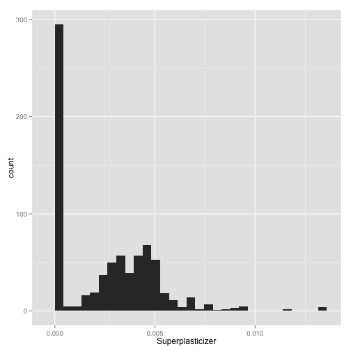
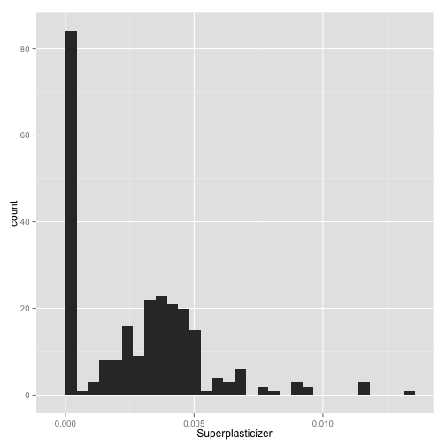

Developing Data Products using R
========================================================


```r
rm(list = ls())
```


AppliedPredictiveModeling package is used to reproduce the analyses in the text. 


```r
library(caret)
```

```
## Loading required package: lattice
## Loading required package: ggplot2
```

```r
library(AppliedPredictiveModeling)
```


```r
data(concrete)
```


```r
`?`(concrete)
```


```r
summary(concrete)
```

```
##      Cement    BlastFurnaceSlag     FlyAsh          Water    
##  Min.   :102   Min.   :  0.0    Min.   :  0.0   Min.   :122  
##  1st Qu.:192   1st Qu.:  0.0    1st Qu.:  0.0   1st Qu.:165  
##  Median :273   Median : 22.0    Median :  0.0   Median :185  
##  Mean   :281   Mean   : 73.9    Mean   : 54.2   Mean   :182  
##  3rd Qu.:350   3rd Qu.:142.9    3rd Qu.:118.3   3rd Qu.:192  
##  Max.   :540   Max.   :359.4    Max.   :200.1   Max.   :247  
##  Superplasticizer CoarseAggregate FineAggregate      Age       
##  Min.   : 0.0     Min.   : 801    Min.   :594   Min.   :  1.0  
##  1st Qu.: 0.0     1st Qu.: 932    1st Qu.:731   1st Qu.:  7.0  
##  Median : 6.4     Median : 968    Median :780   Median : 28.0  
##  Mean   : 6.2     Mean   : 973    Mean   :774   Mean   : 45.7  
##  3rd Qu.:10.2     3rd Qu.:1029    3rd Qu.:824   3rd Qu.: 56.0  
##  Max.   :32.2     Max.   :1145    Max.   :993   Max.   :365.0  
##  CompressiveStrength
##  Min.   : 2.33      
##  1st Qu.:23.71      
##  Median :34.45      
##  Mean   :35.82      
##  3rd Qu.:46.13      
##  Max.   :82.60
```


```r
names(concrete)
```

```
## [1] "Cement"              "BlastFurnaceSlag"    "FlyAsh"             
## [4] "Water"               "Superplasticizer"    "CoarseAggregate"    
## [7] "FineAggregate"       "Age"                 "CompressiveStrength"
```


```r
dim(concrete)
```

```
## [1] 1030    9
```


Check total missing values 

```r
sum(is.na(concrete))
```

```
## [1] 0
```


Partition the dataset

```r
set.seed(975)
inTrain = createDataPartition(mixtures$CompressiveStrength, p = 3/4)[[1]]
```


into test and traininig datasets

```r
training = mixtures[inTrain, ]
testing = mixtures[-inTrain, ]
```


```r
head(training)
```

```
##     Cement BlastFurnaceSlag FlyAsh   Water Superplasticizer
## 23 0.05829          0.08744      0 0.08017                0
## 47 0.14573          0.00000      0 0.08017                0
## 55 0.05829          0.08744      0 0.08017                0
## 56 0.08535          0.05690      0 0.08251                0
## 58 0.08535          0.05690      0 0.08251                0
## 63 0.13341          0.00000      0 0.08263                0
##    CoarseAggregate FineAggregate Age CompressiveStrength
## 23          0.4372        0.3369   3                8.06
## 47          0.4372        0.3369   3               15.05
## 55          0.4372        0.3369   7               14.59
## 56          0.4205        0.3548   7               14.64
## 58          0.4205        0.3548   3                9.13
## 63          0.4179        0.3661   3                9.87
```


```r
str(training)
```

```
## 'data.frame':	774 obs. of  9 variables:
##  $ Cement             : num  0.0583 0.1457 0.0583 0.0853 0.0853 ...
##  $ BlastFurnaceSlag   : num  0.0874 0 0.0874 0.0569 0.0569 ...
##  $ FlyAsh             : num  0 0 0 0 0 ...
##  $ Water              : num  0.0802 0.0802 0.0802 0.0825 0.0825 ...
##  $ Superplasticizer   : num  0 0 0 0 0 ...
##  $ CoarseAggregate    : num  0.437 0.437 0.437 0.42 0.42 ...
##  $ FineAggregate      : num  0.337 0.337 0.337 0.355 0.355 ...
##  $ Age                : int  3 3 7 7 3 3 7 3 28 14 ...
##  $ CompressiveStrength: num  8.06 15.05 14.59 14.64 9.13 ...
```


```r
str(concrete)
```

```
## 'data.frame':	1030 obs. of  9 variables:
##  $ Cement             : num  540 540 332 332 199 ...
##  $ BlastFurnaceSlag   : num  0 0 142 142 132 ...
##  $ FlyAsh             : num  0 0 0 0 0 0 0 0 0 0 ...
##  $ Water              : num  162 162 228 228 192 228 228 228 228 228 ...
##  $ Superplasticizer   : num  2.5 2.5 0 0 0 0 0 0 0 0 ...
##  $ CoarseAggregate    : num  1040 1055 932 932 978 ...
##  $ FineAggregate      : num  676 676 594 594 826 ...
##  $ Age                : int  28 28 270 365 360 90 365 28 28 28 ...
##  $ CompressiveStrength: num  80 61.9 40.3 41 44.3 ...
```


```r
qplot(Superplasticizer, data = concrete)
```

```
## stat_bin: binwidth defaulted to range/30. Use 'binwidth = x' to adjust this.
```

 


```r
qplot(log(Superplasticizer + 2), data = concrete)
```

```
## stat_bin: binwidth defaulted to range/30. Use 'binwidth = x' to adjust this.
```

 


```r
qplot(Superplasticizer, data = mixtures)
```

```
## stat_bin: binwidth defaulted to range/30. Use 'binwidth = x' to adjust this.
```

 


```r
qplot(Superplasticizer, data = training)
```

```
## stat_bin: binwidth defaulted to range/30. Use 'binwidth = x' to adjust this.
```

 


```r
qplot(Superplasticizer, data = testing)
```

```
## stat_bin: binwidth defaulted to range/30. Use 'binwidth = x' to adjust this.
```

 


```r
# rm(list=ls())
set.seed(3433)
# library(AppliedPredictiveModeling)
data(AlzheimerDisease)
```


```r
dim(diagnosis)
```

```
## NULL
```

```r
attributes(diagnosis)
```

```
## $levels
## [1] "Impaired" "Control" 
## 
## $class
## [1] "factor"
```


```r
head(diagnosis)
```

```
## [1] Control  Control  Control  Control  Control  Impaired
## Levels: Impaired Control
```


```r
head(predictors)
```

```
##   ACE_CD143_Angiotensin_Converti ACTH_Adrenocorticotropic_Hormon     AXL
## 1                         2.0031                         -1.3863  1.0984
## 2                         1.5619                         -1.3863  0.6833
## 3                         1.5207                         -1.7148 -0.1453
## 4                         1.6808                         -1.6094  0.6833
## 5                         2.4009                         -0.9676  0.1909
## 6                         0.4312                         -1.2730 -0.2224
##   Adiponectin Alpha_1_Antichymotrypsin Alpha_1_Antitrypsin
## 1      -5.360                    1.740              -12.63
## 2      -5.021                    1.459              -11.91
## 3      -5.809                    1.194              -13.64
## 4      -5.116                    1.281              -15.52
## 5      -4.780                    2.128              -11.13
## 6      -5.221                    1.308              -12.13
##   Alpha_1_Microglobulin Alpha_2_Macroglobulin Angiopoietin_2_ANG_2
## 1                -2.577                -72.65              1.06471
## 2                -3.244               -154.61              0.74194
## 3                -2.882               -136.53              0.83291
## 4                -3.170                -98.36              0.91629
## 5                -2.343               -144.94              0.95551
## 6                -2.551               -154.61             -0.05129
##   Angiotensinogen Apolipoprotein_A_IV Apolipoprotein_A1 Apolipoprotein_A2
## 1           2.511              -1.427            -7.402          -0.26136
## 2           2.457              -1.661            -7.047          -0.86750
## 3           1.976              -1.661            -7.684          -0.65393
## 4           2.376              -2.120            -8.047          -1.23787
## 5           2.862              -1.171            -6.725           0.09531
## 6           2.524              -1.386            -7.402          -0.27444
##   Apolipoprotein_B Apolipoprotein_CI Apolipoprotein_CIII Apolipoprotein_D
## 1           -4.624            -1.273              -2.313            2.079
## 2           -6.748            -1.273              -2.343            1.335
## 3           -3.976            -1.715              -2.749            1.335
## 4           -6.517            -1.966              -2.996            1.435
## 5           -3.379            -0.755              -1.514            1.629
## 6           -2.964            -1.661              -2.313            1.917
##   Apolipoprotein_E Apolipoprotein_H B_Lymphocyte_Chemoattractant_BL  BMP_6
## 1           3.7545         -0.15735                           2.297 -2.201
## 2           3.0971         -0.57540                           1.673 -1.728
## 3           2.7531         -0.34484                           1.673 -2.062
## 4           2.3714         -0.53173                           1.981 -1.983
## 5           3.0671          0.66263                           2.297 -1.242
## 6           0.5911          0.09715                           2.480 -1.877
##   Beta_2_Microglobulin Betacellulin C_Reactive_Protein    CD40     CD5L
## 1               0.6931           34             -4.075 -0.7964  0.09531
## 2               0.4700           53             -6.645 -1.2734 -0.67334
## 3               0.3365           49             -8.047 -1.2415  0.09531
## 4               0.6419           52             -6.215 -1.1238 -0.32850
## 5               0.3365           67             -4.343 -0.9240  0.36331
## 6              -0.5447           51             -7.562 -1.7845  0.40547
##   Calbindin Calcitonin   CgA Clusterin_Apo_J Complement_3
## 1     33.21     1.3863 397.7           3.555       -10.36
## 2     25.28     3.6109 465.7           3.045       -16.11
## 3     22.17     2.1163 347.9           2.773       -16.11
## 4     23.46    -0.1508 334.2           2.833       -13.21
## 5     21.83     1.3083 442.8           3.045       -12.81
## 6     13.23     1.6292 137.9           2.565       -11.98
##   Complement_Factor_H Connective_Tissue_Growth_Factor Cortisol
## 1               3.574                          0.5306       10
## 2               3.600                          0.5878       12
## 3               4.475                          0.6419       10
## 4               3.097                          0.5306       14
## 5               7.245                          0.9163       11
## 6               3.574                          0.9933       13
##   Creatine_Kinase_MB Cystatin_C   EGF_R EN_RAGE ENA_78 Eotaxin_3      FAS
## 1             -1.710      9.042 -0.1355  -3.689 -1.350        53 -0.08338
## 2             -1.751      9.068 -0.3700  -3.817 -1.357        62 -0.52763
## 3             -1.384      8.954 -0.7330  -4.756 -1.391        62 -0.63488
## 4             -1.648      9.582 -0.4219  -2.937 -1.368        44 -0.47804
## 5             -1.626      8.977 -0.6206  -2.364 -1.339        64 -0.12783
## 6             -1.671      7.836 -1.1112  -3.442 -1.364        57 -0.32850
##   FSH_Follicle_Stimulation_Hormon Fas_Ligand Fatty_Acid_Binding_Protein
## 1                         -0.6517      3.101                     2.5209
## 2                         -1.6273      2.979                     2.2478
## 3                         -1.5630      1.360                     0.9063
## 4                         -0.5903      2.537                     0.6237
## 5                         -0.9763      4.037                     2.6346
## 6                         -1.6833      2.407                     0.6237
##   Ferritin Fetuin_A Fibrinogen GRO_alpha Gamma_Interferon_induced_Monokin
## 1    3.329   1.2809     -7.036     1.382                            2.950
## 2    3.933   1.1939     -8.047     1.372                            2.722
## 3    3.177   1.4110     -7.195     1.413                            2.762
## 4    3.138   0.7419     -7.799     1.372                            2.885
## 5    2.690   2.1518     -6.980     1.398                            2.852
## 6    1.847   1.4816     -6.438     1.398                            2.822
##   Glutathione_S_Transferase_alpha HB_EGF  HCC_4
## 1                          1.0641  6.560 -3.037
## 2                          0.8670  8.755 -4.075
## 3                          0.8890  7.745 -3.650
## 4                          0.7084  5.949 -3.817
## 5                          1.2359  7.245 -3.147
## 6                          1.1538  6.413 -3.079
##   Hepatocyte_Growth_Factor_HGF I_309   ICAM_1 IGF_BP_2 IL_11 IL_13 IL_16
## 1                      0.58779 3.434 -0.19078    5.609 5.122 1.283 4.192
## 2                      0.53063 3.135 -0.46202    5.347 4.937 1.269 2.876
## 3                      0.09531 2.398 -0.46202    5.182 4.666 1.274 2.616
## 4                      0.40547 3.367 -0.85727    5.425 6.224 1.308 2.441
## 5                      0.53063 3.761  0.09715    5.421 7.071 1.310 4.736
## 6                      0.09531 2.708 -0.93511    5.056 6.103 1.283 2.671
##   IL_17E IL_1alpha   IL_3  IL_4    IL_5     IL_6 IL_6_Receptor  IL_7  IL_8
## 1  5.731    -6.571 -3.244 2.485  1.0986  0.26937       0.64280 4.805 1.711
## 2  6.706    -8.047 -3.912 2.398  0.6931  0.09622       0.43116 3.706 1.676
## 3  4.149    -8.181 -4.646 1.825 -0.2485  0.18569       0.09669 1.006 1.691
## 4  4.696    -7.601 -4.269 1.482  0.7885 -0.37116       0.57520 2.336 1.720
## 5  4.205    -6.944 -2.996 2.708  1.1632 -0.07205       0.09669 4.288 1.764
## 6  3.637    -8.181 -3.863 1.209 -0.4005  0.18569      -0.51728 2.776 1.708
##   IP_10_Inducible_Protein_10    IgA Insulin Kidney_Injury_Molecule_1_KIM_1
## 1                      6.242 -6.812 -0.6258                         -1.204
## 2                      5.687 -6.377 -0.9431                         -1.198
## 3                      5.050 -6.320 -1.4466                         -1.191
## 4                      5.602 -7.621 -1.4853                         -1.232
## 5                      6.370 -4.646 -0.3003                         -1.164
## 6                      5.481 -5.809 -1.3405                         -1.124
##    LOX_1  Leptin Lipoprotein_a MCP_1  MCP_2    MIF MIP_1alpha MIP_1beta
## 1 1.7047 -1.5291        -4.269 6.741 1.9805 -1.238      4.968     3.258
## 2 1.5261 -1.4661        -4.934 6.849 1.8089 -1.897      3.690     3.135
## 3 1.1632 -1.6623        -5.843 6.767 0.4006 -2.303      4.050     2.398
## 4 1.2238 -1.2694        -4.991 6.781 1.9805 -1.661      4.929     3.219
## 5 1.3610 -0.9151        -2.937 6.723 2.2208 -1.897      6.453     3.526
## 6 0.6419 -1.3613        -4.510 6.541 2.3344 -2.040      4.603     2.890
##   MMP_2  MMP_3  MMP10    MMP7 Myoglobin NT_proBNP NrCAM Osteopontin
## 1 4.479 -2.207 -3.270 -3.7735    -1.897     4.554 5.004       5.357
## 2 3.781 -2.465 -3.650 -5.9682    -0.755     4.220 5.209       6.004
## 3 2.867 -2.303 -2.733 -4.0302    -1.386     4.248 4.745       5.017
## 4 2.969 -1.772 -4.075 -6.8561    -1.139     4.111 4.970       5.768
## 5 3.690 -1.561 -2.617 -0.2222    -1.772     4.466 5.198       5.694
## 6 2.918 -3.037 -3.324 -1.9223    -1.139     4.190 3.258       4.736
##     PAI_1 PAPP_A  PLGF   PYY Pancreatic_polypeptide Prolactin
## 1  1.0035 -2.902 4.443 3.219                 0.5788   0.00000
## 2 -0.0306 -2.813 4.025 3.135                 0.3365  -0.51083
## 3  0.4384 -2.936 4.511 2.890                -0.8916  -0.13926
## 4  0.0000 -2.787 3.434 2.833                -0.8210  -0.04082
## 5  0.2523 -2.936 4.796 3.664                 0.2624   0.18232
## 6  0.4384 -2.936 4.394 3.332                -0.4780  -0.15082
##   Prostatic_Acid_Phosphatase Protein_S Pulmonary_and_Activation_Regulat
## 1                     -1.621    -1.785                          -0.8440
## 2                     -1.739    -2.464                          -2.3026
## 3                     -1.637    -2.259                          -1.6607
## 4                     -1.739    -2.703                          -1.1087
## 5                     -1.697    -1.660                          -0.5621
## 6                     -1.755    -2.358                          -1.1712
##   RANTES Resistin S100b     SGOT   SHBG   SOD Serum_Amyloid_P Sortilin
## 1 -6.215   -16.48 1.562 -0.94161 -1.897 5.609          -5.599    4.909
## 2 -6.938   -16.03 1.757 -0.65393 -1.561 5.814          -6.119    5.479
## 3 -6.645   -16.48 1.436  0.33647 -2.207 5.724          -5.382    3.810
## 4 -5.991   -13.50 1.254 -0.19845 -3.147 5.771          -6.645    3.402
## 5 -6.320   -11.09 1.301  0.09531 -2.430 5.656          -5.203    3.402
## 6 -6.502   -11.29 1.055 -0.31471 -2.645 4.543          -5.116    2.979
##   Stem_Cell_Factor TGF_alpha TIMP_1  TNF_RII TRAIL_R3 TTR_prealbumin
## 1            4.174     8.649  15.20 -0.06188  -0.1829          2.944
## 2            3.714    11.332  11.27 -0.32850  -0.5007          2.833
## 3            3.434    10.858  12.28 -0.41552  -0.9240          2.944
## 4            3.951     9.454  11.11 -0.34249  -0.3849          2.944
## 5            4.060     8.323  13.75 -0.34249  -0.8583          3.045
## 6            2.565    10.009  11.27 -0.94161  -0.7380          3.045
##   Tamm_Horsfall_Protein_THP Thrombomodulin Thrombopoietin
## 1                    -3.096         -1.341       -0.10263
## 2                    -3.111         -1.675       -0.67335
## 3                    -3.167         -1.534       -0.92297
## 4                    -3.156         -1.975       -0.75100
## 5                    -3.038         -1.211        0.09762
## 6                    -3.126         -1.452       -1.00000
##   Thymus_Expressed_Chemokine_TECK Thyroid_Stimulating_Hormone
## 1                           4.149                      -3.863
## 2                           3.810                      -4.828
## 3                           2.792                      -4.991
## 4                           4.037                      -4.893
## 5                           4.534                      -4.646
## 6                           4.534                      -4.423
##   Thyroxine_Binding_Globulin Tissue_Factor Transferrin
## 1                     -1.427       2.04122       3.332
## 2                     -1.609       2.02815       2.890
## 3                     -1.897       1.43508       2.890
## 4                     -2.040       2.02815       2.890
## 5                     -0.478       1.98787       3.497
## 6                     -1.238      -0.01005       2.996
##   Trefoil_Factor_3_TFF3 VCAM_1  VEGF Vitronectin von_Willebrand_Factor
## 1                -3.381  3.258 22.03    -0.04082                -3.147
## 2                -3.912  2.708 18.60    -0.38566                -3.863
## 3                -3.730  2.639 17.48    -0.22314                -3.540
## 4                -3.817  2.773 17.55    -0.65393                -3.863
## 5                -3.442  3.045 20.78     0.16622                -3.817
## 6                -4.343  2.208 13.20     0.26236                -4.510
##      age   tau p_tau Ab_42 male Genotype
## 1 0.9876 6.298 4.348 12.02    0     E3E3
## 2 0.9861 6.659 4.860 11.02    0     E3E4
## 3 0.9867 6.271 4.400 12.30    1     E3E4
## 4 0.9867 6.153 4.495 12.40    0     E3E4
## 5 0.9872 6.624 4.525 11.02    0     E3E3
## 6 0.9842 5.361 3.466 11.23    1     E4E4
```


```r
adData = data.frame(diagnosis, predictors)
head(adData)
```

```
##   diagnosis ACE_CD143_Angiotensin_Converti ACTH_Adrenocorticotropic_Hormon
## 1   Control                         2.0031                         -1.3863
## 2   Control                         1.5619                         -1.3863
## 3   Control                         1.5207                         -1.7148
## 4   Control                         1.6808                         -1.6094
## 5   Control                         2.4009                         -0.9676
## 6  Impaired                         0.4312                         -1.2730
##       AXL Adiponectin Alpha_1_Antichymotrypsin Alpha_1_Antitrypsin
## 1  1.0984      -5.360                    1.740              -12.63
## 2  0.6833      -5.021                    1.459              -11.91
## 3 -0.1453      -5.809                    1.194              -13.64
## 4  0.6833      -5.116                    1.281              -15.52
## 5  0.1909      -4.780                    2.128              -11.13
## 6 -0.2224      -5.221                    1.308              -12.13
##   Alpha_1_Microglobulin Alpha_2_Macroglobulin Angiopoietin_2_ANG_2
## 1                -2.577                -72.65              1.06471
## 2                -3.244               -154.61              0.74194
## 3                -2.882               -136.53              0.83291
## 4                -3.170                -98.36              0.91629
## 5                -2.343               -144.94              0.95551
## 6                -2.551               -154.61             -0.05129
##   Angiotensinogen Apolipoprotein_A_IV Apolipoprotein_A1 Apolipoprotein_A2
## 1           2.511              -1.427            -7.402          -0.26136
## 2           2.457              -1.661            -7.047          -0.86750
## 3           1.976              -1.661            -7.684          -0.65393
## 4           2.376              -2.120            -8.047          -1.23787
## 5           2.862              -1.171            -6.725           0.09531
## 6           2.524              -1.386            -7.402          -0.27444
##   Apolipoprotein_B Apolipoprotein_CI Apolipoprotein_CIII Apolipoprotein_D
## 1           -4.624            -1.273              -2.313            2.079
## 2           -6.748            -1.273              -2.343            1.335
## 3           -3.976            -1.715              -2.749            1.335
## 4           -6.517            -1.966              -2.996            1.435
## 5           -3.379            -0.755              -1.514            1.629
## 6           -2.964            -1.661              -2.313            1.917
##   Apolipoprotein_E Apolipoprotein_H B_Lymphocyte_Chemoattractant_BL  BMP_6
## 1           3.7545         -0.15735                           2.297 -2.201
## 2           3.0971         -0.57540                           1.673 -1.728
## 3           2.7531         -0.34484                           1.673 -2.062
## 4           2.3714         -0.53173                           1.981 -1.983
## 5           3.0671          0.66263                           2.297 -1.242
## 6           0.5911          0.09715                           2.480 -1.877
##   Beta_2_Microglobulin Betacellulin C_Reactive_Protein    CD40     CD5L
## 1               0.6931           34             -4.075 -0.7964  0.09531
## 2               0.4700           53             -6.645 -1.2734 -0.67334
## 3               0.3365           49             -8.047 -1.2415  0.09531
## 4               0.6419           52             -6.215 -1.1238 -0.32850
## 5               0.3365           67             -4.343 -0.9240  0.36331
## 6              -0.5447           51             -7.562 -1.7845  0.40547
##   Calbindin Calcitonin   CgA Clusterin_Apo_J Complement_3
## 1     33.21     1.3863 397.7           3.555       -10.36
## 2     25.28     3.6109 465.7           3.045       -16.11
## 3     22.17     2.1163 347.9           2.773       -16.11
## 4     23.46    -0.1508 334.2           2.833       -13.21
## 5     21.83     1.3083 442.8           3.045       -12.81
## 6     13.23     1.6292 137.9           2.565       -11.98
##   Complement_Factor_H Connective_Tissue_Growth_Factor Cortisol
## 1               3.574                          0.5306       10
## 2               3.600                          0.5878       12
## 3               4.475                          0.6419       10
## 4               3.097                          0.5306       14
## 5               7.245                          0.9163       11
## 6               3.574                          0.9933       13
##   Creatine_Kinase_MB Cystatin_C   EGF_R EN_RAGE ENA_78 Eotaxin_3      FAS
## 1             -1.710      9.042 -0.1355  -3.689 -1.350        53 -0.08338
## 2             -1.751      9.068 -0.3700  -3.817 -1.357        62 -0.52763
## 3             -1.384      8.954 -0.7330  -4.756 -1.391        62 -0.63488
## 4             -1.648      9.582 -0.4219  -2.937 -1.368        44 -0.47804
## 5             -1.626      8.977 -0.6206  -2.364 -1.339        64 -0.12783
## 6             -1.671      7.836 -1.1112  -3.442 -1.364        57 -0.32850
##   FSH_Follicle_Stimulation_Hormon Fas_Ligand Fatty_Acid_Binding_Protein
## 1                         -0.6517      3.101                     2.5209
## 2                         -1.6273      2.979                     2.2478
## 3                         -1.5630      1.360                     0.9063
## 4                         -0.5903      2.537                     0.6237
## 5                         -0.9763      4.037                     2.6346
## 6                         -1.6833      2.407                     0.6237
##   Ferritin Fetuin_A Fibrinogen GRO_alpha Gamma_Interferon_induced_Monokin
## 1    3.329   1.2809     -7.036     1.382                            2.950
## 2    3.933   1.1939     -8.047     1.372                            2.722
## 3    3.177   1.4110     -7.195     1.413                            2.762
## 4    3.138   0.7419     -7.799     1.372                            2.885
## 5    2.690   2.1518     -6.980     1.398                            2.852
## 6    1.847   1.4816     -6.438     1.398                            2.822
##   Glutathione_S_Transferase_alpha HB_EGF  HCC_4
## 1                          1.0641  6.560 -3.037
## 2                          0.8670  8.755 -4.075
## 3                          0.8890  7.745 -3.650
## 4                          0.7084  5.949 -3.817
## 5                          1.2359  7.245 -3.147
## 6                          1.1538  6.413 -3.079
##   Hepatocyte_Growth_Factor_HGF I_309   ICAM_1 IGF_BP_2 IL_11 IL_13 IL_16
## 1                      0.58779 3.434 -0.19078    5.609 5.122 1.283 4.192
## 2                      0.53063 3.135 -0.46202    5.347 4.937 1.269 2.876
## 3                      0.09531 2.398 -0.46202    5.182 4.666 1.274 2.616
## 4                      0.40547 3.367 -0.85727    5.425 6.224 1.308 2.441
## 5                      0.53063 3.761  0.09715    5.421 7.071 1.310 4.736
## 6                      0.09531 2.708 -0.93511    5.056 6.103 1.283 2.671
##   IL_17E IL_1alpha   IL_3  IL_4    IL_5     IL_6 IL_6_Receptor  IL_7  IL_8
## 1  5.731    -6.571 -3.244 2.485  1.0986  0.26937       0.64280 4.805 1.711
## 2  6.706    -8.047 -3.912 2.398  0.6931  0.09622       0.43116 3.706 1.676
## 3  4.149    -8.181 -4.646 1.825 -0.2485  0.18569       0.09669 1.006 1.691
## 4  4.696    -7.601 -4.269 1.482  0.7885 -0.37116       0.57520 2.336 1.720
## 5  4.205    -6.944 -2.996 2.708  1.1632 -0.07205       0.09669 4.288 1.764
## 6  3.637    -8.181 -3.863 1.209 -0.4005  0.18569      -0.51728 2.776 1.708
##   IP_10_Inducible_Protein_10    IgA Insulin Kidney_Injury_Molecule_1_KIM_1
## 1                      6.242 -6.812 -0.6258                         -1.204
## 2                      5.687 -6.377 -0.9431                         -1.198
## 3                      5.050 -6.320 -1.4466                         -1.191
## 4                      5.602 -7.621 -1.4853                         -1.232
## 5                      6.370 -4.646 -0.3003                         -1.164
## 6                      5.481 -5.809 -1.3405                         -1.124
##    LOX_1  Leptin Lipoprotein_a MCP_1  MCP_2    MIF MIP_1alpha MIP_1beta
## 1 1.7047 -1.5291        -4.269 6.741 1.9805 -1.238      4.968     3.258
## 2 1.5261 -1.4661        -4.934 6.849 1.8089 -1.897      3.690     3.135
## 3 1.1632 -1.6623        -5.843 6.767 0.4006 -2.303      4.050     2.398
## 4 1.2238 -1.2694        -4.991 6.781 1.9805 -1.661      4.929     3.219
## 5 1.3610 -0.9151        -2.937 6.723 2.2208 -1.897      6.453     3.526
## 6 0.6419 -1.3613        -4.510 6.541 2.3344 -2.040      4.603     2.890
##   MMP_2  MMP_3  MMP10    MMP7 Myoglobin NT_proBNP NrCAM Osteopontin
## 1 4.479 -2.207 -3.270 -3.7735    -1.897     4.554 5.004       5.357
## 2 3.781 -2.465 -3.650 -5.9682    -0.755     4.220 5.209       6.004
## 3 2.867 -2.303 -2.733 -4.0302    -1.386     4.248 4.745       5.017
## 4 2.969 -1.772 -4.075 -6.8561    -1.139     4.111 4.970       5.768
## 5 3.690 -1.561 -2.617 -0.2222    -1.772     4.466 5.198       5.694
## 6 2.918 -3.037 -3.324 -1.9223    -1.139     4.190 3.258       4.736
##     PAI_1 PAPP_A  PLGF   PYY Pancreatic_polypeptide Prolactin
## 1  1.0035 -2.902 4.443 3.219                 0.5788   0.00000
## 2 -0.0306 -2.813 4.025 3.135                 0.3365  -0.51083
## 3  0.4384 -2.936 4.511 2.890                -0.8916  -0.13926
## 4  0.0000 -2.787 3.434 2.833                -0.8210  -0.04082
## 5  0.2523 -2.936 4.796 3.664                 0.2624   0.18232
## 6  0.4384 -2.936 4.394 3.332                -0.4780  -0.15082
##   Prostatic_Acid_Phosphatase Protein_S Pulmonary_and_Activation_Regulat
## 1                     -1.621    -1.785                          -0.8440
## 2                     -1.739    -2.464                          -2.3026
## 3                     -1.637    -2.259                          -1.6607
## 4                     -1.739    -2.703                          -1.1087
## 5                     -1.697    -1.660                          -0.5621
## 6                     -1.755    -2.358                          -1.1712
##   RANTES Resistin S100b     SGOT   SHBG   SOD Serum_Amyloid_P Sortilin
## 1 -6.215   -16.48 1.562 -0.94161 -1.897 5.609          -5.599    4.909
## 2 -6.938   -16.03 1.757 -0.65393 -1.561 5.814          -6.119    5.479
## 3 -6.645   -16.48 1.436  0.33647 -2.207 5.724          -5.382    3.810
## 4 -5.991   -13.50 1.254 -0.19845 -3.147 5.771          -6.645    3.402
## 5 -6.320   -11.09 1.301  0.09531 -2.430 5.656          -5.203    3.402
## 6 -6.502   -11.29 1.055 -0.31471 -2.645 4.543          -5.116    2.979
##   Stem_Cell_Factor TGF_alpha TIMP_1  TNF_RII TRAIL_R3 TTR_prealbumin
## 1            4.174     8.649  15.20 -0.06188  -0.1829          2.944
## 2            3.714    11.332  11.27 -0.32850  -0.5007          2.833
## 3            3.434    10.858  12.28 -0.41552  -0.9240          2.944
## 4            3.951     9.454  11.11 -0.34249  -0.3849          2.944
## 5            4.060     8.323  13.75 -0.34249  -0.8583          3.045
## 6            2.565    10.009  11.27 -0.94161  -0.7380          3.045
##   Tamm_Horsfall_Protein_THP Thrombomodulin Thrombopoietin
## 1                    -3.096         -1.341       -0.10263
## 2                    -3.111         -1.675       -0.67335
## 3                    -3.167         -1.534       -0.92297
## 4                    -3.156         -1.975       -0.75100
## 5                    -3.038         -1.211        0.09762
## 6                    -3.126         -1.452       -1.00000
##   Thymus_Expressed_Chemokine_TECK Thyroid_Stimulating_Hormone
## 1                           4.149                      -3.863
## 2                           3.810                      -4.828
## 3                           2.792                      -4.991
## 4                           4.037                      -4.893
## 5                           4.534                      -4.646
## 6                           4.534                      -4.423
##   Thyroxine_Binding_Globulin Tissue_Factor Transferrin
## 1                     -1.427       2.04122       3.332
## 2                     -1.609       2.02815       2.890
## 3                     -1.897       1.43508       2.890
## 4                     -2.040       2.02815       2.890
## 5                     -0.478       1.98787       3.497
## 6                     -1.238      -0.01005       2.996
##   Trefoil_Factor_3_TFF3 VCAM_1  VEGF Vitronectin von_Willebrand_Factor
## 1                -3.381  3.258 22.03    -0.04082                -3.147
## 2                -3.912  2.708 18.60    -0.38566                -3.863
## 3                -3.730  2.639 17.48    -0.22314                -3.540
## 4                -3.817  2.773 17.55    -0.65393                -3.863
## 5                -3.442  3.045 20.78     0.16622                -3.817
## 6                -4.343  2.208 13.20     0.26236                -4.510
##      age   tau p_tau Ab_42 male Genotype
## 1 0.9876 6.298 4.348 12.02    0     E3E3
## 2 0.9861 6.659 4.860 11.02    0     E3E4
## 3 0.9867 6.271 4.400 12.30    1     E3E4
## 4 0.9867 6.153 4.495 12.40    0     E3E4
## 5 0.9872 6.624 4.525 11.02    0     E3E3
## 6 0.9842 5.361 3.466 11.23    1     E4E4
```


```r
inTrain = createDataPartition(adData$diagnosis, p = 3/4)[[1]]
training = adData[inTrain, ]
testing = adData[-inTrain, ]
```


```r
tr <- training[colnames(training)[grepl("^IL", colnames(training))]]
summary(tr)
```

```
##      IL_11          IL_13          IL_16           IL_17E    
##  Min.   :2.03   Min.   :1.24   Min.   :0.957   Min.   :1.05  
##  1st Qu.:3.71   1st Qu.:1.27   1st Qu.:2.461   1st Qu.:4.15  
##  Median :4.80   Median :1.28   Median :2.924   Median :4.80  
##  Mean   :4.70   Mean   :1.28   Mean   :2.915   Mean   :4.91  
##  3rd Qu.:5.68   3rd Qu.:1.29   3rd Qu.:3.351   3rd Qu.:5.63  
##  Max.   :7.80   Max.   :1.32   Max.   :4.937   Max.   :8.95  
##    IL_1alpha          IL_3            IL_4            IL_5        
##  Min.   :-8.52   Min.   :-5.92   Min.   :0.531   Min.   :-1.0498  
##  1st Qu.:-7.85   1st Qu.:-4.27   1st Qu.:1.459   1st Qu.:-0.0943  
##  Median :-7.54   Median :-3.96   Median :1.808   Median : 0.1823  
##  Mean   :-7.54   Mean   :-3.95   Mean   :1.765   Mean   : 0.1876  
##  3rd Qu.:-7.26   3rd Qu.:-3.58   3rd Qu.:2.079   3rd Qu.: 0.4700  
##  Max.   :-5.95   Max.   :-2.45   Max.   :3.045   Max.   : 1.1632  
##       IL_6         IL_6_Receptor          IL_7           IL_8     
##  Min.   :-1.5343   Min.   :-0.7456   Min.   :0.56   Min.   :1.57  
##  1st Qu.:-0.4127   1st Qu.:-0.1475   1st Qu.:2.15   1st Qu.:1.68  
##  Median :-0.0934   Median : 0.0967   Median :2.92   Median :1.71  
##  Mean   :-0.1386   Mean   : 0.0789   Mean   :2.91   Mean   :1.70  
##  3rd Qu.: 0.1857   3rd Qu.: 0.2730   3rd Qu.:3.71   3rd Qu.:1.73  
##  Max.   : 1.8138   Max.   : 0.7705   Max.   :5.71   Max.   :1.81
```

```r
preProc <- preProcess(tr, method = "pca", thresh = 0.8)
preProc
```

```
## 
## Call:
## preProcess.default(x = tr, method = "pca", thresh = 0.8)
## 
## Created from 251 samples and 12 variables
## Pre-processing: principal component signal extraction, scaled, centered 
## 
## PCA needed 7 components to capture 80 percent of the variance
```


```r
rm(list = ls())
set.seed(3433)
library(AppliedPredictiveModeling)
data(AlzheimerDisease)
adData = data.frame(diagnosis, predictors)
inTrain = createDataPartition(adData$diagnosis, p = 3/4)[[1]]
training = adData[inTrain, ]
testing = adData[-inTrain, ]
train_il <- training[colnames(training)[grepl("^IL", colnames(training))]]
str(train_il)
```

```
## 'data.frame':	251 obs. of  12 variables:
##  $ IL_11        : num  6.1 4.59 6.92 3.22 4.1 ...
##  $ IL_13        : num  1.28 1.27 1.27 1.29 1.27 ...
##  $ IL_16        : num  2.67 3.48 2.15 3.59 2.88 ...
##  $ IL_17E       : num  3.64 3.64 4.75 3.87 5.73 ...
##  $ IL_1alpha    : num  -8.18 -7.37 -7.85 -8.05 -7.85 ...
##  $ IL_3         : num  -3.86 -4.02 -4.51 -3.58 -4.51 ...
##  $ IL_4         : num  1.21 1.81 1.57 1.92 1.81 ...
##  $ IL_5         : num  -0.4 0.182 0.182 0.336 0 ...
##  $ IL_6         : num  0.186 -1.534 -1.097 -0.399 0.422 ...
##  $ IL_6_Receptor: num  -0.5173 0.0967 0.354 0.0967 -0.5322 ...
##  $ IL_7         : num  2.78 2.15 2.92 2.92 1.56 ...
##  $ IL_8         : num  1.71 1.7 1.72 1.68 1.69 ...
```


Prediction function # 1 

```r
library(caret)
diagnosis[inTrain]
```

```
##   [1] Impaired Impaired Impaired Impaired Impaired Impaired Impaired
##   [8] Impaired Impaired Impaired Impaired Impaired Impaired Impaired
##  [15] Impaired Impaired Impaired Impaired Impaired Impaired Impaired
##  [22] Impaired Impaired Impaired Impaired Impaired Impaired Impaired
##  [29] Impaired Impaired Impaired Impaired Impaired Impaired Impaired
##  [36] Impaired Impaired Impaired Impaired Impaired Impaired Impaired
##  [43] Impaired Impaired Impaired Impaired Impaired Impaired Impaired
##  [50] Impaired Impaired Impaired Impaired Impaired Impaired Impaired
##  [57] Impaired Impaired Impaired Impaired Impaired Impaired Impaired
##  [64] Impaired Impaired Impaired Impaired Impaired Impaired Control 
##  [71] Control  Control  Control  Control  Control  Control  Control 
##  [78] Control  Control  Control  Control  Control  Control  Control 
##  [85] Control  Control  Control  Control  Control  Control  Control 
##  [92] Control  Control  Control  Control  Control  Control  Control 
##  [99] Control  Control  Control  Control  Control  Control  Control 
## [106] Control  Control  Control  Control  Control  Control  Control 
## [113] Control  Control  Control  Control  Control  Control  Control 
## [120] Control  Control  Control  Control  Control  Control  Control 
## [127] Control  Control  Control  Control  Control  Control  Control 
## [134] Control  Control  Control  Control  Control  Control  Control 
## [141] Control  Control  Control  Control  Control  Control  Control 
## [148] Control  Control  Control  Control  Control  Control  Control 
## [155] Control  Control  Control  Control  Control  Control  Control 
## [162] Control  Control  Control  Control  Control  Control  Control 
## [169] Control  Control  Control  Control  Control  Control  Control 
## [176] Control  Control  Control  Control  Control  Control  Control 
## [183] Control  Control  Control  Control  Control  Control  Control 
## [190] Control  Control  Control  Control  Control  Control  Control 
## [197] Control  Control  Control  Control  Control  Control  Control 
## [204] Control  Control  Control  Control  Control  Control  Control 
## [211] Control  Control  Control  Control  Control  Control  Control 
## [218] Control  Control  Control  Control  Control  Control  Control 
## [225] Control  Control  Control  Control  Control  Control  Control 
## [232] Control  Control  Control  Control  Control  Control  Control 
## [239] Control  Control  Control  Control  Control  Control  Control 
## [246] Control  Control  Control  Control  Control  Control 
## Levels: Impaired Control
```

```r
length(diagnosis[inTrain])
```

```
## [1] 251
```

```r
modelFit <- train(diagnosis[inTrain] ~ ., method = "glm", data = train_il)

ab <- cbind(train_il, diagnosis[inTrain])
ab$diagnosis[inTrain]
```

```
##   [1] Impaired Impaired Impaired Impaired Impaired Impaired Impaired
##   [8] Impaired Impaired Impaired Impaired Impaired Impaired Impaired
##  [15] Impaired Impaired Impaired Impaired Impaired Impaired Impaired
##  [22] Impaired Impaired Impaired Control  Control  Control  Control 
##  [29] Control  Control  Control  Control  Control  Control  Control 
##  [36] Control  Control  Control  Control  Control  Control  Control 
##  [43] Control  Control  Control  Control  Control  Control  Control 
##  [50] Control  Control  Control  Control  Control  Control  Control 
##  [57] Control  <NA>     <NA>     <NA>     <NA>     <NA>     <NA>    
##  [64] <NA>     <NA>     <NA>     <NA>     <NA>     <NA>     Impaired
##  [71] Impaired Impaired Impaired Impaired Impaired Impaired Impaired
##  [78] Impaired Impaired Impaired Impaired Impaired Impaired Impaired
##  [85] Impaired Impaired Impaired Impaired Impaired Impaired Impaired
##  [92] Impaired Impaired Impaired Impaired Impaired Impaired Impaired
##  [99] Impaired Control  Control  Control  Control  Control  Control 
## [106] Control  Control  Control  Control  Control  Control  Control 
## [113] Control  Control  Control  Control  Control  Control  Control 
## [120] Control  Control  Control  Control  Control  Control  Control 
## [127] Control  Control  Control  Control  Control  Control  Control 
## [134] Control  Control  Control  Control  Control  Control  Control 
## [141] Control  Control  Control  Control  Control  Control  Control 
## [148] Control  Control  Control  Control  Control  Control  Control 
## [155] Control  Control  Control  Control  Control  Control  Control 
## [162] Control  Control  Control  Control  Control  Control  Control 
## [169] Control  Control  Control  Control  Control  Control  Control 
## [176] Control  Control  Control  Control  Control  Control  Control 
## [183] Control  Control  Control  Control  Control  Control  Control 
## [190] Control  Control  Control  Control  Control  Control  Control 
## [197] Control  Control  Control  Control  Control  Control  <NA>    
## [204] <NA>     <NA>     <NA>     <NA>     <NA>     <NA>     <NA>    
## [211] <NA>     <NA>     <NA>     <NA>     <NA>     <NA>     <NA>    
## [218] <NA>     <NA>     <NA>     <NA>     <NA>     <NA>     <NA>    
## [225] <NA>     <NA>     <NA>     <NA>     <NA>     <NA>     <NA>    
## [232] <NA>     <NA>     <NA>     <NA>     <NA>     <NA>     <NA>    
## [239] <NA>     <NA>     <NA>     <NA>     <NA>     <NA>     <NA>    
## [246] <NA>     <NA>     <NA>     <NA>     <NA>     <NA>    
## Levels: Impaired Control
```

```r
modelFit <- train(ab$diagnosis[inTrain] ~ ., method = "glm", data = ab)
```

