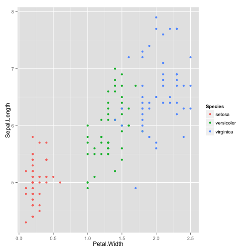

Developing Data Products using R
========================================================


```r
rm(list=ls())
```


AppliedPredictiveModeling package is used to reproduce the analyses in the text. 


```r
library(caret)
```

```
## Loading required package: lattice
## Loading required package: ggplot2
```

```r
library(AppliedPredictiveModeling)
```


```r
data(concrete)
```

Concrete - Data sets from different sources that can be used for modeling the compressive strength of concrete formulations as a functions of their ingredients and age.

```r
#?concrete
```


```r
summary(concrete)
```

```
##      Cement    BlastFurnaceSlag     FlyAsh          Water     Superplasticizer CoarseAggregate FineAggregate      Age        CompressiveStrength
##  Min.   :102   Min.   :  0.0    Min.   :  0.0   Min.   :122   Min.   : 0.0     Min.   : 801    Min.   :594   Min.   :  1.0   Min.   : 2.33      
##  1st Qu.:192   1st Qu.:  0.0    1st Qu.:  0.0   1st Qu.:165   1st Qu.: 0.0     1st Qu.: 932    1st Qu.:731   1st Qu.:  7.0   1st Qu.:23.71      
##  Median :273   Median : 22.0    Median :  0.0   Median :185   Median : 6.4     Median : 968    Median :780   Median : 28.0   Median :34.45      
##  Mean   :281   Mean   : 73.9    Mean   : 54.2   Mean   :182   Mean   : 6.2     Mean   : 973    Mean   :774   Mean   : 45.7   Mean   :35.82      
##  3rd Qu.:350   3rd Qu.:142.9    3rd Qu.:118.3   3rd Qu.:192   3rd Qu.:10.2     3rd Qu.:1029    3rd Qu.:824   3rd Qu.: 56.0   3rd Qu.:46.13      
##  Max.   :540   Max.   :359.4    Max.   :200.1   Max.   :247   Max.   :32.2     Max.   :1145    Max.   :993   Max.   :365.0   Max.   :82.60
```


```r
names(concrete)
```

```
## [1] "Cement"              "BlastFurnaceSlag"    "FlyAsh"              "Water"               "Superplasticizer"    "CoarseAggregate"     "FineAggregate"      
## [8] "Age"                 "CompressiveStrength"
```


```r
dim(concrete)
```

```
## [1] 1030    9
```

Check total missing values 

```r
sum(is.na(concrete))
```

```
## [1] 0
```

Partition the dataset

```r
set.seed(975)
inTrain = createDataPartition(mixtures$CompressiveStrength, p = 3/4)[[1]]
```

into test and traininig datasets

```r
training = mixtures[ inTrain,]
testing = mixtures[-inTrain,]
```


```r
head(training)
```

```
##     Cement BlastFurnaceSlag FlyAsh   Water Superplasticizer CoarseAggregate FineAggregate Age CompressiveStrength
## 23 0.05829          0.08744      0 0.08017                0          0.4372        0.3369   3                8.06
## 47 0.14573          0.00000      0 0.08017                0          0.4372        0.3369   3               15.05
## 55 0.05829          0.08744      0 0.08017                0          0.4372        0.3369   7               14.59
## 56 0.08535          0.05690      0 0.08251                0          0.4205        0.3548   7               14.64
## 58 0.08535          0.05690      0 0.08251                0          0.4205        0.3548   3                9.13
## 63 0.13341          0.00000      0 0.08263                0          0.4179        0.3661   3                9.87
```


```r
str(training)
```

```
## 'data.frame':	774 obs. of  9 variables:
##  $ Cement             : num  0.0583 0.1457 0.0583 0.0853 0.0853 ...
##  $ BlastFurnaceSlag   : num  0.0874 0 0.0874 0.0569 0.0569 ...
##  $ FlyAsh             : num  0 0 0 0 0 ...
##  $ Water              : num  0.0802 0.0802 0.0802 0.0825 0.0825 ...
##  $ Superplasticizer   : num  0 0 0 0 0 ...
##  $ CoarseAggregate    : num  0.437 0.437 0.437 0.42 0.42 ...
##  $ FineAggregate      : num  0.337 0.337 0.337 0.355 0.355 ...
##  $ Age                : int  3 3 7 7 3 3 7 3 28 14 ...
##  $ CompressiveStrength: num  8.06 15.05 14.59 14.64 9.13 ...
```


```r
#str(concrete)
```


```r
qplot(Superplasticizer, data=concrete)
```

```
## stat_bin: binwidth defaulted to range/30. Use 'binwidth = x' to adjust this.
```

 


```r
qplot(log(Superplasticizer + 2), data=concrete)
```

```
## stat_bin: binwidth defaulted to range/30. Use 'binwidth = x' to adjust this.
```

 

The skewness cannot be removed, becuase the values are exactly the same. 


```r
set.seed(3433)
data(AlzheimerDisease)
```


```r
names(predictors)
```

```
##   [1] "ACE_CD143_Angiotensin_Converti"   "ACTH_Adrenocorticotropic_Hormon"  "AXL"                              "Adiponectin"                     
##   [5] "Alpha_1_Antichymotrypsin"         "Alpha_1_Antitrypsin"              "Alpha_1_Microglobulin"            "Alpha_2_Macroglobulin"           
##   [9] "Angiopoietin_2_ANG_2"             "Angiotensinogen"                  "Apolipoprotein_A_IV"              "Apolipoprotein_A1"               
##  [13] "Apolipoprotein_A2"                "Apolipoprotein_B"                 "Apolipoprotein_CI"                "Apolipoprotein_CIII"             
##  [17] "Apolipoprotein_D"                 "Apolipoprotein_E"                 "Apolipoprotein_H"                 "B_Lymphocyte_Chemoattractant_BL" 
##  [21] "BMP_6"                            "Beta_2_Microglobulin"             "Betacellulin"                     "C_Reactive_Protein"              
##  [25] "CD40"                             "CD5L"                             "Calbindin"                        "Calcitonin"                      
##  [29] "CgA"                              "Clusterin_Apo_J"                  "Complement_3"                     "Complement_Factor_H"             
##  [33] "Connective_Tissue_Growth_Factor"  "Cortisol"                         "Creatine_Kinase_MB"               "Cystatin_C"                      
##  [37] "EGF_R"                            "EN_RAGE"                          "ENA_78"                           "Eotaxin_3"                       
##  [41] "FAS"                              "FSH_Follicle_Stimulation_Hormon"  "Fas_Ligand"                       "Fatty_Acid_Binding_Protein"      
##  [45] "Ferritin"                         "Fetuin_A"                         "Fibrinogen"                       "GRO_alpha"                       
##  [49] "Gamma_Interferon_induced_Monokin" "Glutathione_S_Transferase_alpha"  "HB_EGF"                           "HCC_4"                           
##  [53] "Hepatocyte_Growth_Factor_HGF"     "I_309"                            "ICAM_1"                           "IGF_BP_2"                        
##  [57] "IL_11"                            "IL_13"                            "IL_16"                            "IL_17E"                          
##  [61] "IL_1alpha"                        "IL_3"                             "IL_4"                             "IL_5"                            
##  [65] "IL_6"                             "IL_6_Receptor"                    "IL_7"                             "IL_8"                            
##  [69] "IP_10_Inducible_Protein_10"       "IgA"                              "Insulin"                          "Kidney_Injury_Molecule_1_KIM_1"  
##  [73] "LOX_1"                            "Leptin"                           "Lipoprotein_a"                    "MCP_1"                           
##  [77] "MCP_2"                            "MIF"                              "MIP_1alpha"                       "MIP_1beta"                       
##  [81] "MMP_2"                            "MMP_3"                            "MMP10"                            "MMP7"                            
##  [85] "Myoglobin"                        "NT_proBNP"                        "NrCAM"                            "Osteopontin"                     
##  [89] "PAI_1"                            "PAPP_A"                           "PLGF"                             "PYY"                             
##  [93] "Pancreatic_polypeptide"           "Prolactin"                        "Prostatic_Acid_Phosphatase"       "Protein_S"                       
##  [97] "Pulmonary_and_Activation_Regulat" "RANTES"                           "Resistin"                         "S100b"                           
## [101] "SGOT"                             "SHBG"                             "SOD"                              "Serum_Amyloid_P"                 
## [105] "Sortilin"                         "Stem_Cell_Factor"                 "TGF_alpha"                        "TIMP_1"                          
## [109] "TNF_RII"                          "TRAIL_R3"                         "TTR_prealbumin"                   "Tamm_Horsfall_Protein_THP"       
## [113] "Thrombomodulin"                   "Thrombopoietin"                   "Thymus_Expressed_Chemokine_TECK"  "Thyroid_Stimulating_Hormone"     
## [117] "Thyroxine_Binding_Globulin"       "Tissue_Factor"                    "Transferrin"                      "Trefoil_Factor_3_TFF3"           
## [121] "VCAM_1"                           "VEGF"                             "Vitronectin"                      "von_Willebrand_Factor"           
## [125] "age"                              "tau"                              "p_tau"                            "Ab_42"                           
## [129] "male"                             "Genotype"
```


```r
head(diagnosis)
```

```
## [1] Control  Control  Control  Control  Control  Impaired
## Levels: Impaired Control
```

Factor with two levels - Impaired and Control

```r
attributes(diagnosis)
```

```
## $levels
## [1] "Impaired" "Control" 
## 
## $class
## [1] "factor"
```


```r
adData = data.frame(diagnosis,predictors);names(adData)
```

```
##   [1] "diagnosis"                        "ACE_CD143_Angiotensin_Converti"   "ACTH_Adrenocorticotropic_Hormon"  "AXL"                             
##   [5] "Adiponectin"                      "Alpha_1_Antichymotrypsin"         "Alpha_1_Antitrypsin"              "Alpha_1_Microglobulin"           
##   [9] "Alpha_2_Macroglobulin"            "Angiopoietin_2_ANG_2"             "Angiotensinogen"                  "Apolipoprotein_A_IV"             
##  [13] "Apolipoprotein_A1"                "Apolipoprotein_A2"                "Apolipoprotein_B"                 "Apolipoprotein_CI"               
##  [17] "Apolipoprotein_CIII"              "Apolipoprotein_D"                 "Apolipoprotein_E"                 "Apolipoprotein_H"                
##  [21] "B_Lymphocyte_Chemoattractant_BL"  "BMP_6"                            "Beta_2_Microglobulin"             "Betacellulin"                    
##  [25] "C_Reactive_Protein"               "CD40"                             "CD5L"                             "Calbindin"                       
##  [29] "Calcitonin"                       "CgA"                              "Clusterin_Apo_J"                  "Complement_3"                    
##  [33] "Complement_Factor_H"              "Connective_Tissue_Growth_Factor"  "Cortisol"                         "Creatine_Kinase_MB"              
##  [37] "Cystatin_C"                       "EGF_R"                            "EN_RAGE"                          "ENA_78"                          
##  [41] "Eotaxin_3"                        "FAS"                              "FSH_Follicle_Stimulation_Hormon"  "Fas_Ligand"                      
##  [45] "Fatty_Acid_Binding_Protein"       "Ferritin"                         "Fetuin_A"                         "Fibrinogen"                      
##  [49] "GRO_alpha"                        "Gamma_Interferon_induced_Monokin" "Glutathione_S_Transferase_alpha"  "HB_EGF"                          
##  [53] "HCC_4"                            "Hepatocyte_Growth_Factor_HGF"     "I_309"                            "ICAM_1"                          
##  [57] "IGF_BP_2"                         "IL_11"                            "IL_13"                            "IL_16"                           
##  [61] "IL_17E"                           "IL_1alpha"                        "IL_3"                             "IL_4"                            
##  [65] "IL_5"                             "IL_6"                             "IL_6_Receptor"                    "IL_7"                            
##  [69] "IL_8"                             "IP_10_Inducible_Protein_10"       "IgA"                              "Insulin"                         
##  [73] "Kidney_Injury_Molecule_1_KIM_1"   "LOX_1"                            "Leptin"                           "Lipoprotein_a"                   
##  [77] "MCP_1"                            "MCP_2"                            "MIF"                              "MIP_1alpha"                      
##  [81] "MIP_1beta"                        "MMP_2"                            "MMP_3"                            "MMP10"                           
##  [85] "MMP7"                             "Myoglobin"                        "NT_proBNP"                        "NrCAM"                           
##  [89] "Osteopontin"                      "PAI_1"                            "PAPP_A"                           "PLGF"                            
##  [93] "PYY"                              "Pancreatic_polypeptide"           "Prolactin"                        "Prostatic_Acid_Phosphatase"      
##  [97] "Protein_S"                        "Pulmonary_and_Activation_Regulat" "RANTES"                           "Resistin"                        
## [101] "S100b"                            "SGOT"                             "SHBG"                             "SOD"                             
## [105] "Serum_Amyloid_P"                  "Sortilin"                         "Stem_Cell_Factor"                 "TGF_alpha"                       
## [109] "TIMP_1"                           "TNF_RII"                          "TRAIL_R3"                         "TTR_prealbumin"                  
## [113] "Tamm_Horsfall_Protein_THP"        "Thrombomodulin"                   "Thrombopoietin"                   "Thymus_Expressed_Chemokine_TECK" 
## [117] "Thyroid_Stimulating_Hormone"      "Thyroxine_Binding_Globulin"       "Tissue_Factor"                    "Transferrin"                     
## [121] "Trefoil_Factor_3_TFF3"            "VCAM_1"                           "VEGF"                             "Vitronectin"                     
## [125] "von_Willebrand_Factor"            "age"                              "tau"                              "p_tau"                           
## [129] "Ab_42"                            "male"                             "Genotype"
```


```r
dim(adData)
```

```
## [1] 333 131
```


```r
inTrain = createDataPartition(adData$diagnosis, p = 3/4)[[1]]
training = adData[ inTrain,]
testing = adData[-inTrain,]
```

Select the names which start with IL only

```r
tr  <- training[colnames(training)[grepl('^IL',colnames(training))]]
summary(tr)
```

```
##      IL_11          IL_13          IL_16           IL_17E       IL_1alpha          IL_3            IL_4            IL_5              IL_6        
##  Min.   :2.03   Min.   :1.24   Min.   :0.957   Min.   :1.05   Min.   :-8.52   Min.   :-5.92   Min.   :0.531   Min.   :-1.0498   Min.   :-1.5343  
##  1st Qu.:3.71   1st Qu.:1.27   1st Qu.:2.461   1st Qu.:4.15   1st Qu.:-7.85   1st Qu.:-4.27   1st Qu.:1.459   1st Qu.:-0.0943   1st Qu.:-0.4127  
##  Median :4.80   Median :1.28   Median :2.924   Median :4.80   Median :-7.54   Median :-3.96   Median :1.808   Median : 0.1823   Median :-0.0934  
##  Mean   :4.70   Mean   :1.28   Mean   :2.915   Mean   :4.91   Mean   :-7.54   Mean   :-3.95   Mean   :1.765   Mean   : 0.1876   Mean   :-0.1386  
##  3rd Qu.:5.68   3rd Qu.:1.29   3rd Qu.:3.351   3rd Qu.:5.63   3rd Qu.:-7.26   3rd Qu.:-3.58   3rd Qu.:2.079   3rd Qu.: 0.4700   3rd Qu.: 0.1857  
##  Max.   :7.80   Max.   :1.32   Max.   :4.937   Max.   :8.95   Max.   :-5.95   Max.   :-2.45   Max.   :3.045   Max.   : 1.1632   Max.   : 1.8138  
##  IL_6_Receptor          IL_7           IL_8     
##  Min.   :-0.7456   Min.   :0.56   Min.   :1.57  
##  1st Qu.:-0.1475   1st Qu.:2.15   1st Qu.:1.68  
##  Median : 0.0967   Median :2.92   Median :1.71  
##  Mean   : 0.0789   Mean   :2.91   Mean   :1.70  
##  3rd Qu.: 0.2730   3rd Qu.:3.71   3rd Qu.:1.73  
##  Max.   : 0.7705   Max.   :5.71   Max.   :1.81
```

Using pca recuve the number of features to account for 80% variance. 

```r
preProc  <- preProcess(tr,method="pca",thresh = 0.8)
preProc
```

```
## 
## Call:
## preProcess.default(x = tr, method = "pca", thresh = 0.8)
## 
## Created from 251 samples and 12 variables
## Pre-processing: principal component signal extraction, scaled, centered 
## 
## PCA needed 7 components to capture 80 percent of the variance
```


```r
rm(list=ls())
set.seed(3433)
library(AppliedPredictiveModeling)
data(AlzheimerDisease)
adData = data.frame(diagnosis,predictors)
inTrain = createDataPartition(adData$diagnosis, p = 3/4)[[1]]
training = adData[ inTrain,]
testing = adData[-inTrain,]
```


```r
train_il  <- training[colnames(training)[grepl('^IL',colnames(training))]]
str(train_il)
```

```
## 'data.frame':	251 obs. of  12 variables:
##  $ IL_11        : num  6.1 4.59 6.92 3.22 4.1 ...
##  $ IL_13        : num  1.28 1.27 1.27 1.29 1.27 ...
##  $ IL_16        : num  2.67 3.48 2.15 3.59 2.88 ...
##  $ IL_17E       : num  3.64 3.64 4.75 3.87 5.73 ...
##  $ IL_1alpha    : num  -8.18 -7.37 -7.85 -8.05 -7.85 ...
##  $ IL_3         : num  -3.86 -4.02 -4.51 -3.58 -4.51 ...
##  $ IL_4         : num  1.21 1.81 1.57 1.92 1.81 ...
##  $ IL_5         : num  -0.4 0.182 0.182 0.336 0 ...
##  $ IL_6         : num  0.186 -1.534 -1.097 -0.399 0.422 ...
##  $ IL_6_Receptor: num  -0.5173 0.0967 0.354 0.0967 -0.5322 ...
##  $ IL_7         : num  2.78 2.15 2.92 2.92 1.56 ...
##  $ IL_8         : num  1.71 1.7 1.72 1.68 1.69 ...
```

Prediction function # 1 

```r
library(caret)
head(diagnosis[inTrain])
```

```
## [1] Impaired Impaired Impaired Impaired Impaired Impaired
## Levels: Impaired Control
```

```r
length(diagnosis[inTrain])
```

```
## [1] 251
```

glm - Generalized Linear Models 
Fit the dataset using `glm`. 

```r
modelFit  <- train(diagnosis[inTrain] ~ ., method="glm",data=train_il)

ab  <- cbind(train_il,diagnosis[inTrain])
ab$diagnosis[inTrain]
```

```
##   [1] Impaired Impaired Impaired Impaired Impaired Impaired Impaired Impaired Impaired Impaired Impaired Impaired Impaired Impaired Impaired Impaired Impaired
##  [18] Impaired Impaired Impaired Impaired Impaired Impaired Impaired Control  Control  Control  Control  Control  Control  Control  Control  Control  Control 
##  [35] Control  Control  Control  Control  Control  Control  Control  Control  Control  Control  Control  Control  Control  Control  Control  Control  Control 
##  [52] Control  Control  Control  Control  Control  Control  <NA>     <NA>     <NA>     <NA>     <NA>     <NA>     <NA>     <NA>     <NA>     <NA>     <NA>    
##  [69] <NA>     Impaired Impaired Impaired Impaired Impaired Impaired Impaired Impaired Impaired Impaired Impaired Impaired Impaired Impaired Impaired Impaired
##  [86] Impaired Impaired Impaired Impaired Impaired Impaired Impaired Impaired Impaired Impaired Impaired Impaired Impaired Impaired Control  Control  Control 
## [103] Control  Control  Control  Control  Control  Control  Control  Control  Control  Control  Control  Control  Control  Control  Control  Control  Control 
## [120] Control  Control  Control  Control  Control  Control  Control  Control  Control  Control  Control  Control  Control  Control  Control  Control  Control 
## [137] Control  Control  Control  Control  Control  Control  Control  Control  Control  Control  Control  Control  Control  Control  Control  Control  Control 
## [154] Control  Control  Control  Control  Control  Control  Control  Control  Control  Control  Control  Control  Control  Control  Control  Control  Control 
## [171] Control  Control  Control  Control  Control  Control  Control  Control  Control  Control  Control  Control  Control  Control  Control  Control  Control 
## [188] Control  Control  Control  Control  Control  Control  Control  Control  Control  Control  Control  Control  Control  Control  Control  <NA>     <NA>    
## [205] <NA>     <NA>     <NA>     <NA>     <NA>     <NA>     <NA>     <NA>     <NA>     <NA>     <NA>     <NA>     <NA>     <NA>     <NA>     <NA>     <NA>    
## [222] <NA>     <NA>     <NA>     <NA>     <NA>     <NA>     <NA>     <NA>     <NA>     <NA>     <NA>     <NA>     <NA>     <NA>     <NA>     <NA>     <NA>    
## [239] <NA>     <NA>     <NA>     <NA>     <NA>     <NA>     <NA>     <NA>     <NA>     <NA>     <NA>     <NA>     <NA>    
## Levels: Impaired Control
```

```r
modelFit  <- train(ab$diagnosis[inTrain] ~ ., method="glm",data=ab)
```


Using Plotly 
------------

Initialize a Plotly object :

```r
library(plotly)
```

```
## Loading required package: RCurl
## Loading required package: bitops
## Loading required package: RJSONIO
```

```r
py <- plotly()
```

Now you can make interactive, online graphs with `ggplot2` syntax using `py$ggplotly()`


```r
(ggiris <- qplot(Petal.Width, Sepal.Length, data = iris, color = Species))
```

 

```r
r <- py$ggplotly(ggiris)
r$response$url
```

```
## NULL
```


```r
library(plotly)

dsamp <- diamonds[sample(nrow(diamonds), 1000), ]
d <- qplot(carat, price, data=dsamp, colour=clarity);d
```

 

```r
py$ggplotly()
```


Manipulate
----------


```r
library(manipulate)
library(HistData)
data(Galton)
myHist <- function(mu){
  hist(Galton$child,col="blue",breaks=100)
  lines(c(mu, mu), c(0, 150),col="red",lwd=5)
  mse <- mean((Galton$child - mu)^2)
  text(63, 150, paste("mu = ", mu))
  text(63, 140, paste("MSE = ", round(mse, 2)))
}
manipulate(myHist(mu), mu = slider(62, 74, step = 0.5))
```

```
## Error: no such symbol rs_createUUID
```


```r
library(manipulate)
myPlot <- function(s) {
    plot(cars$dist - mean(cars$dist), cars$speed - mean(cars$speed))
    abline(0, s)
}


manipulate(myPlot(s), s = slider(0, 2, step = 0.1))
```

```
## Error: no such symbol rs_createUUID
```


rCharts
--------

```r
require(rCharts)
```

```
## Loading required package: rCharts
```

```r
haireye  <- as.data.frame(HairEyeColor)

n1  <- nPlot(Freq ~ Hair, group = 'Eye', type = 'multiBarChart',
             data = subset(haireye, Sex == 'Male'))

n1$save('figure/n1.html', cdn = TRUE)
cat('<iframe src="figure/n1.html" width=100%, height=600></iframe>')
```

```
## <iframe src="figure/n1.html" width=100%, height=600></iframe>
```


```r
nPlot(Freq ~ Hair, group = 'Eye', type = 'multiBarChart',
             data = subset(haireye, Sex == 'Male'))
```

```
## <iframe src=' figure/unnamed-chunk-30.html ' scrolling='no' frameBorder='0' seamless class='rChart nvd3 ' id=iframe- chart3ff047990067 ></iframe> <style>iframe.rChart{ width: 100%; height: 400px;}</style>
```

bring up the plot 

```r
n1
```

```
## <iframe src=' figure/unnamed-chunk-31.html ' scrolling='no' frameBorder='0' seamless class='rChart nvd3 ' id=iframe- chart3ff020320d85 ></iframe> <style>iframe.rChart{ width: 100%; height: 400px;}</style>
```

Displays the html required for the plot 

```r
n1$html()
```

```
## [1] "<script type='text/javascript'>\n $(document).ready(function(){\n      drawchart3ff020320d85()\n    });\n    function drawchart3ff020320d85(){  \n      var opts = {\n \"dom\": \"chart3ff020320d85\",\n\"width\":    800,\n\"height\":    400,\n\"x\": \"Hair\",\n\"y\": \"Freq\",\n\"group\": \"Eye\",\n\"type\": \"multiBarChart\",\n\"id\": \"chart3ff020320d85\" \n},\n        data = [\n {\n \"Hair\": \"Black\",\n\"Eye\": \"Brown\",\n\"Sex\": \"Male\",\n\"Freq\":             32 \n},\n{\n \"Hair\": \"Brown\",\n\"Eye\": \"Brown\",\n\"Sex\": \"Male\",\n\"Freq\":             53 \n},\n{\n \"Hair\": \"Red\",\n\"Eye\": \"Brown\",\n\"Sex\": \"Male\",\n\"Freq\":             10 \n},\n{\n \"Hair\": \"Blond\",\n\"Eye\": \"Brown\",\n\"Sex\": \"Male\",\n\"Freq\":              3 \n},\n{\n \"Hair\": \"Black\",\n\"Eye\": \"Blue\",\n\"Sex\": \"Male\",\n\"Freq\":             11 \n},\n{\n \"Hair\": \"Brown\",\n\"Eye\": \"Blue\",\n\"Sex\": \"Male\",\n\"Freq\":             50 \n},\n{\n \"Hair\": \"Red\",\n\"Eye\": \"Blue\",\n\"Sex\": \"Male\",\n\"Freq\":             10 \n},\n{\n \"Hair\": \"Blond\",\n\"Eye\": \"Blue\",\n\"Sex\": \"Male\",\n\"Freq\":             30 \n},\n{\n \"Hair\": \"Black\",\n\"Eye\": \"Hazel\",\n\"Sex\": \"Male\",\n\"Freq\":             10 \n},\n{\n \"Hair\": \"Brown\",\n\"Eye\": \"Hazel\",\n\"Sex\": \"Male\",\n\"Freq\":             25 \n},\n{\n \"Hair\": \"Red\",\n\"Eye\": \"Hazel\",\n\"Sex\": \"Male\",\n\"Freq\":              7 \n},\n{\n \"Hair\": \"Blond\",\n\"Eye\": \"Hazel\",\n\"Sex\": \"Male\",\n\"Freq\":              5 \n},\n{\n \"Hair\": \"Black\",\n\"Eye\": \"Green\",\n\"Sex\": \"Male\",\n\"Freq\":              3 \n},\n{\n \"Hair\": \"Brown\",\n\"Eye\": \"Green\",\n\"Sex\": \"Male\",\n\"Freq\":             15 \n},\n{\n \"Hair\": \"Red\",\n\"Eye\": \"Green\",\n\"Sex\": \"Male\",\n\"Freq\":              7 \n},\n{\n \"Hair\": \"Blond\",\n\"Eye\": \"Green\",\n\"Sex\": \"Male\",\n\"Freq\":              8 \n} \n]\n  \n      if(!(opts.type===\"pieChart\" || opts.type===\"sparklinePlus\" || opts.type===\"bulletChart\")) {\n        var data = d3.nest()\n          .key(function(d){\n            //return opts.group === undefined ? 'main' : d[opts.group]\n            //instead of main would think a better default is opts.x\n            return opts.group === undefined ? opts.y : d[opts.group];\n          })\n          .entries(data);\n      }\n      \n      if (opts.disabled != undefined){\n        data.map(function(d, i){\n          d.disabled = opts.disabled[i]\n        })\n      }\n      \n      nv.addGraph(function() {\n        var chart = nv.models[opts.type]()\n          .width(opts.width)\n          .height(opts.height)\n          \n        if (opts.type != \"bulletChart\"){\n          chart\n            .x(function(d) { return d[opts.x] })\n            .y(function(d) { return d[opts.y] })\n        }\n          \n         \n        \n          \n        \n\n        \n        \n        \n      \n       d3.select(\"#\" + opts.id)\n        .append('svg')\n        .datum(data)\n        .transition().duration(500)\n        .call(chart);\n\n       nv.utils.windowResize(chart.update);\n       return chart;\n      });\n    };\n</script>"
```


Another example 

```r
names(iris) = gsub("\\.","",names(iris))
r1  <- rPlot(SepalLength ~ SepalWidth | Species, data = iris, 
             color = "Species", type = "point")
r1$save("figure/r1.html", cdn = TRUE)
cat('<iframe src="figure/r1.html" width=100%, height=600></iframe>')
```

```
## <iframe src="figure/r1.html" width=100%, height=600></iframe>
```


```r
hair_eye  <- as.data.frame(HairEyeColor)
r2  <-rPlot(Freq ~ Hair| Eye, color = "eye", data = hair_eye, type="bar")
r2
```

```
## <iframe src=' figure/Facetter Scatterplot.html ' scrolling='no' frameBorder='0' seamless class='rChart polycharts ' id=iframe- chart3ff02ac87e3d ></iframe> <style>iframe.rChart{ width: 100%; height: 400px;}</style>
```

```r
r2$save("figure/r2.html", cdn = TRUE)
cat('<iframe src = "figure/r2.html" width=100%, height=600></iframe>')
```

```
## <iframe src = "figure/r2.html" width=100%, height=600></iframe>
```


How to get the js, html or publish an rChart 


```r
r1  <- rPlot(mpg ~ wt| am + vs, data = mtcars, type="point", color = "gear"); r1
```

```
## <iframe src=' figure/unnamed-chunk-33.html ' scrolling='no' frameBorder='0' seamless class='rChart polycharts ' id=iframe- chart3ff0ff7541b ></iframe> <style>iframe.rChart{ width: 100%; height: 400px;}</style>
```

```r
r1$print("chart1") # Print out the js 
```

```
## 
## <div id = 'chart1' class = 'rChart polycharts'></div>
## <script type='text/javascript'>
##     var chartParams = {
##  "dom": "chart1",
## "width":    800,
## "height":    400,
## "layers": [
##  {
##  "x": "wt",
## "y": "mpg",
## "data": {
##  "mpg": [     21,     21,   22.8,   21.4,   18.7,   18.1,   14.3,   24.4,   22.8,   19.2,   17.8,   16.4,   17.3,   15.2,   10.4,   10.4,   14.7,   32.4,   30.4,   33.9,   21.5,   15.5,   15.2,   13.3,   19.2,   27.3,     26,   30.4,   15.8,   19.7,     15,   21.4 ],
## "cyl": [      6,      6,      4,      6,      8,      6,      8,      4,      4,      6,      6,      8,      8,      8,      8,      8,      8,      4,      4,      4,      4,      8,      8,      8,      8,      4,      4,      4,      8,      6,      8,      4 ],
## "disp": [    160,    160,    108,    258,    360,    225,    360,  146.7,  140.8,  167.6,  167.6,  275.8,  275.8,  275.8,    472,    460,    440,   78.7,   75.7,   71.1,  120.1,    318,    304,    350,    400,     79,  120.3,   95.1,    351,    145,    301,    121 ],
## "hp": [    110,    110,     93,    110,    175,    105,    245,     62,     95,    123,    123,    180,    180,    180,    205,    215,    230,     66,     52,     65,     97,    150,    150,    245,    175,     66,     91,    113,    264,    175,    335,    109 ],
## "drat": [    3.9,    3.9,   3.85,   3.08,   3.15,   2.76,   3.21,   3.69,   3.92,   3.92,   3.92,   3.07,   3.07,   3.07,   2.93,      3,   3.23,   4.08,   4.93,   4.22,    3.7,   2.76,   3.15,   3.73,   3.08,   4.08,   4.43,   3.77,   4.22,   3.62,   3.54,   4.11 ],
## "wt": [   2.62,  2.875,   2.32,  3.215,   3.44,   3.46,   3.57,   3.19,   3.15,   3.44,   3.44,   4.07,   3.73,   3.78,   5.25,  5.424,  5.345,    2.2,  1.615,  1.835,  2.465,   3.52,  3.435,   3.84,  3.845,  1.935,   2.14,  1.513,   3.17,   2.77,   3.57,   2.78 ],
## "qsec": [  16.46,  17.02,  18.61,  19.44,  17.02,  20.22,  15.84,     20,   22.9,   18.3,   18.9,   17.4,   17.6,     18,  17.98,  17.82,  17.42,  19.47,  18.52,   19.9,  20.01,  16.87,   17.3,  15.41,  17.05,   18.9,   16.7,   16.9,   14.5,   15.5,   14.6,   18.6 ],
## "vs": [      0,      0,      1,      1,      0,      1,      0,      1,      1,      1,      1,      0,      0,      0,      0,      0,      0,      1,      1,      1,      1,      0,      0,      0,      0,      1,      0,      1,      0,      0,      0,      1 ],
## "am": [      1,      1,      1,      0,      0,      0,      0,      0,      0,      0,      0,      0,      0,      0,      0,      0,      0,      1,      1,      1,      0,      0,      0,      0,      0,      1,      1,      1,      1,      1,      1,      1 ],
## "gear": [      4,      4,      4,      3,      3,      3,      3,      4,      4,      4,      4,      3,      3,      3,      3,      3,      3,      4,      4,      4,      3,      3,      3,      3,      3,      4,      5,      5,      5,      5,      5,      4 ],
## "carb": [      4,      4,      1,      1,      2,      1,      4,      2,      2,      4,      4,      3,      3,      3,      4,      4,      4,      1,      2,      1,      1,      2,      2,      4,      2,      1,      2,      2,      4,      6,      8,      2 ] 
## },
## "facet": [ "am", "vs" ],
## "type": "point",
## "color": "gear" 
## } 
## ],
## "facet": {
##  "type": "grid",
## "x": "am",
## "y": "vs" 
## },
## "guides": [],
## "coord": [],
## "id": "chart1" 
## }
##     _.each(chartParams.layers, function(el){
##         el.data = polyjs.data(el.data)
##     })
##     var graph_chart1 = polyjs.chart(chartParams);
## </script>
```

```r
r1$save('myPlot.html') # Save the html file.
# ------
# not working 
r1$publish('myPlot.html', host='gist') # save to gist, rjson required 
```

```
## Loading required package: httr
```

```
## Please enter your github username: 
## Please enter your github password:
```

```
## Your gist has been published
```

```
## Error: a character vector argument expected
```

```r
r1$publish('myPlot', host = 'rpubs') # Save ti rpubs
```

```
## Claim your page on RPubs at: 
## http://rpubs.com/publish/claim/22074/676a51a6b22646d0a23ca3eeb1a3d4b1
```


```r
r1$publish
```

```
## Class method definition for method publish()
## function (description = "", id = NULL, ..., host = "gist") 
## {
##     htmlFile = file.path(tempdir(), "index.html")
##     on.exit(unlink(htmlFile))
##     .self$save(destfile = htmlFile, cdn = T)
##     if (!is.null(.self$srccode)) {
##         codeFile = file.path(tempdir(), "code.R")
##         on.exit(unlink(codeFile))
##         writeLines(.self$srccode, con = codeFile)
##         files = c(htmlFile, codeFile)
##     }
##     else {
##         files = htmlFile
##     }
##     class(files) = host
##     if (is.null(id) && (html_id != "")) {
##         id = html_id
##     }
##     html_id <<- publish_(files = files, description = description, 
##         id = id, ...)
## }
## <environment: 0x7fa160efb468>
```


```r
data(economics, package="ggplot2")
?economics
str(economics)
```

```
## 'data.frame':	478 obs. of  6 variables:
##  $ date    : Date, format: "1967-06-30" "1967-07-31" "1967-08-31" "1967-09-30" ...
##  $ pce     : num  508 511 517 513 518 ...
##  $ pop     : int  198712 198911 199113 199311 199498 199657 199808 199920 200056 200208 ...
##  $ psavert : num  9.8 9.8 9 9.8 9.7 9.4 9 9.5 8.9 9.6 ...
##  $ uempmed : num  4.5 4.7 4.6 4.9 4.7 4.8 5.1 4.5 4.1 4.6 ...
##  $ unemploy: int  2944 2945 2958 3143 3066 3018 2878 3001 2877 2709 ...
```

```r
econ  <- transform(economics, data = as.character(date))
str(econ)
```

```
## 'data.frame':	478 obs. of  7 variables:
##  $ date    : Date, format: "1967-06-30" "1967-07-31" "1967-08-31" "1967-09-30" ...
##  $ pce     : num  508 511 517 513 518 ...
##  $ pop     : int  198712 198911 199113 199311 199498 199657 199808 199920 200056 200208 ...
##  $ psavert : num  9.8 9.8 9 9.8 9.7 9.4 9 9.5 8.9 9.6 ...
##  $ uempmed : num  4.5 4.7 4.6 4.9 4.7 4.8 5.1 4.5 4.1 4.6 ...
##  $ unemploy: int  2944 2945 2958 3143 3066 3018 2878 3001 2877 2709 ...
##  $ data    : Factor w/ 478 levels "1967-06-30","1967-07-31",..: 1 2 3 4 5 6 7 8 9 10 ...
```

```r
m1  <- mPlot(x = "date", y = c("psavert", "uempmed"), type="Line", data = econ); m1
```

```
## Loading required package: reshape2
```

```
## <iframe src=' figure/morris.html ' scrolling='no' frameBorder='0' seamless class='rChart morris ' id=iframe- chart3ff062582407 ></iframe> <style>iframe.rChart{ width: 100%; height: 400px;}</style>
```

```r
m1$set(pointSize=0, lineWidth=1);m1
```

```
## <iframe src=' figure/morris.html ' scrolling='no' frameBorder='0' seamless class='rChart morris ' id=iframe- chart3ff062582407 ></iframe> <style>iframe.rChart{ width: 100%; height: 400px;}</style>
```


```r
require(reshape2)
uspexp  <- melt(USPersonalExpenditure)
View(USPersonalExpenditure)
View(uspexp)
names(uspexp)[1:2]  <- c("category", "year")
x1  <- xPlot(value ~ year, group = "category", data = uspexp, type="line-dotted");x1
```

```
## <iframe src=' figure/xCharts.html ' scrolling='no' frameBorder='0' seamless class='rChart xcharts ' id=iframe- chart3ff027ed1dbd ></iframe> <style>iframe.rChart{ width: 100%; height: 400px;}</style>
```


```r
map3  <- Leaflet$new()
map3$setView(c(51.505, -0.09), zoom = 13)
map3$marker(c(51.5, -0.09), bindPopup = "<p> Hi, I am a popup </p>")
map3$marker(c(51.495, -0.083), bindPopup = "<p> Hi, I am another popup </p>")
map3
```

```
## <iframe src=' figure/Leaflet.html ' scrolling='no' frameBorder='0' seamless class='rChart leaflet ' id=iframe- chart3ff0344775 ></iframe> <style>iframe.rChart{ width: 100%; height: 400px;}</style>
```


```r
usp  <- reshape2::melt(USPersonalExpenditure)
# Get the decades into a date Rickshaw likes 
usp$Var2  <- as.numeric(as.POSIXct(paste0(usp$Var2, "-01-01")))
p4  <- Rickshaw$new()
p4$layer(value ~ Var2, group = "Var1", data = usp, type = "area", width = 560); p4
```

```
## <iframe src=' figure/Rikshaw.html ' scrolling='no' frameBorder='0' seamless class='rChart rickshaw ' id=iframe- chart3ff0683f526d ></iframe> <style>iframe.rChart{ width: 100%; height: 400px;}</style>
```

```r
# Add a helpful slider this easily; other features TRUE as default
p4$set(slider=TRUE); p4
```

```
## <iframe src=' figure/Rikshaw.html ' scrolling='no' frameBorder='0' seamless class='rChart rickshaw ' id=iframe- chart3ff0683f526d ></iframe> <style>iframe.rChart{ width: 100%; height: 400px;}</style>
```


```r
h1  <- hPlot(x = "Wr.Hnd", y = "NW.Hnd", data = MASS::survey, 
             type=c("line","bubble","scatter"), group = "NW.Hnd",
             size="Age");h1
```

```
## Warning: Observations with NA has been removed
```

```
## <iframe src=' figure/highchart.html ' scrolling='no' frameBorder='0' seamless class='rChart highcharts ' id=iframe- chart3ff0153ca793 ></iframe> <style>iframe.rChart{ width: 100%; height: 400px;}</style>
```

```r
library("MASS")
?survey # Student Survey Data
#Wr.Hnd: span (distance from tip of thumb to tip of little finger of spread hand) of writing hand, in centimetres.
#NW.Hnd:span of non-writing hand.


dataSet  <- MASS::survey; View(dataSet[,c("Wr.Hnd", "NW.Hnd", "Age")])
```


```r
require(rCharts)
data(airquality)
View(airquality)
dTable(airquality, sPaginationType = "full_numbers")
```

```
## <iframe src=' figure/unnamed-chunk-35.html ' scrolling='no' frameBorder='0' seamless class='rChart datatables ' id=iframe- chart3ff0267ae7d6 ></iframe> <style>iframe.rChart{ width: 100%; height: 400px;}</style>
```


Shiny 


```r
library(shiny)
```


